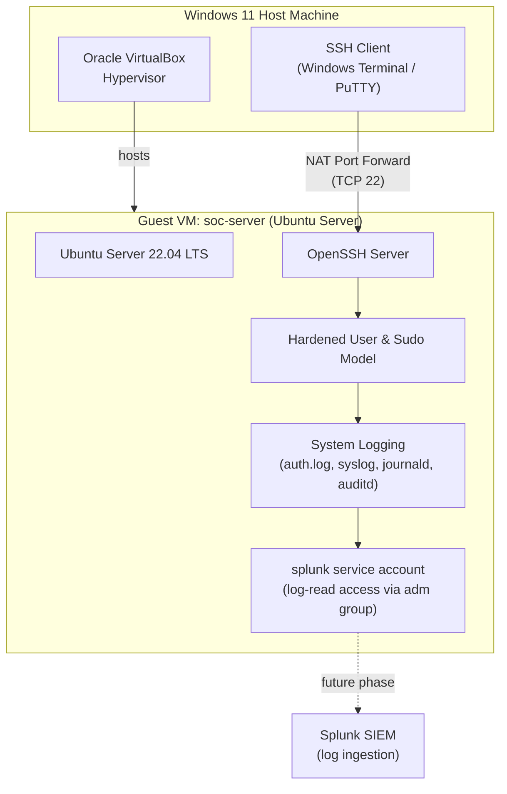

# SecureWatch Home SOC

**A Personal Security Operations Center — built from scratch, hardened by hand, and instrumented for detection.**


---

## What This Project Is

SecureWatch Home SOC is a home-lab implementation of the infrastructure a real Security Operations Center depends on: a hardened Linux host, secure remote administration, centralized logging, and a log pipeline ready for SIEM ingestion. It's built entirely on free tooling (Oracle VirtualBox, Ubuntu Server, native Linux logging/auditing, and Splunk) inside a virtualized lab on a Windows 11 host.

The project is intentionally documented the way infrastructure changes are documented in a real SOC or IT environment: every command is explained in terms of *why* it's run, not just *what* it does, and every phase records the problems that came up and how they were resolved. That "why" layer is the difference between someone who can copy commands from a wiki and someone who understands the system they're defending.

## Why This Project Exists

Job postings for Junior SOC Analyst, Blue Team, and IT Support roles consistently ask for skills that are hard to demonstrate without hands-on infrastructure: Linux administration, secure remote access, log management, and familiarity with SIEM concepts. This lab is my answer to that gap — a reproducible environment where I built, broke, fixed, and hardened each layer myself, and documented the reasoning behind every decision.

## Architecture at a Glance



## Lab Environment

| Component | Detail |
|---|---|
| Host OS | Windows 11 |
| Hypervisor | Oracle VirtualBox |
| Guest OS | Ubuntu Server (LTS) |
| Hostname | `soc-server` |
| Networking | NAT with SSH port forwarding |
| Remote Access | SSH from Windows host |
| Log Sources | `auth.log`, `syslog`, `journald`, `auditd` |
| SIEM Target | Splunk (log ingestion prep) |

## Project Roadmap

| Phase | Title | Status | Summary |
|---|---|---|---|
| [Phase 1](docs/phase-01/README.md) | Infrastructure Foundation | ✅ Complete | VM provisioning, networking, base OS configuration |
| [Phase 2](docs/phase-02/README.md) | Remote Administration | ✅ Complete | SSH hardening and secure remote access from Windows |
| [Phase 2.5](docs/phase-02.5/README.md) | Linux Server Hardening | ✅ Complete | User/group model, sudo, permissions, password policy |
| [Phase 3](docs/phase-03/README.md) | Logging & SIEM Preparation | ✅ Complete | Log architecture, auditd, Splunk-ready log access |
| Phase 4 | Detection & Alerting | 🔜 Planned | SIEM ingestion, detection rules, dashboards |
| Phase 5 | Attack Simulation | 🔜 Planned | Controlled attack scenarios against the lab |
| Phase 6 | Incident Response | 🔜 Planned | Investigation, containment, and reporting workflow |

## Repository Structure

```
SecureWatch-Home-SOC/
├── README.md                      # You are here
├── docs/
│   ├── phase-01/                  # Infrastructure Foundation
│   │   ├── README.md
│   │   ├── architecture.md
│   │   ├── commands.md
│   │   └── troubleshooting.md
│   ├── phase-02/                  # Remote Administration
│   │   ├── README.md
│   │   ├── architecture.md
│   │   ├── commands.md
│   │   └── troubleshooting.md
│   ├── phase-02.5/                # Linux Server Hardening
│   │   ├── README.md
│   │   ├── commands.md
│   │   └── hardening.md
│   └── phase-03/                  # Logging & SIEM Preparation
│       ├── README.md
│       ├── architecture.md
│       ├── logging.md
│       ├── commands.md
│       └── troubleshooting.md
├── images/                        # Diagram exports (PNG/SVG)
├── drawio/                        # Editable draw.io source files
└── assets/                        # Supporting assets
```

## How to Use This Repository

Each phase folder is self-contained and follows the same structure: an overview and objectives, an architecture diagram, annotated commands with expected output, a troubleshooting log, and a "lessons learned" section. Start at Phase 1 and work forward — later phases assume the hardening and logging decisions made earlier.

## Skills Demonstrated

`Linux System Administration` · `SSH Hardening` · `Identity & Access Management` · `File Permissions & Ownership` · `sudo / Least Privilege` · `Linux Logging (syslog, journald, auditd)` · `SIEM Log Onboarding` · `Technical Documentation` · `Network Fundamentals (NAT, Port Forwarding)`

## Author

Built and documented as part of an ongoing home-lab SOC portfolio project.

---

*This repository is a living project. Phases 4–6 (SIEM detection, attack simulation, and incident response) are actively in progress.*
