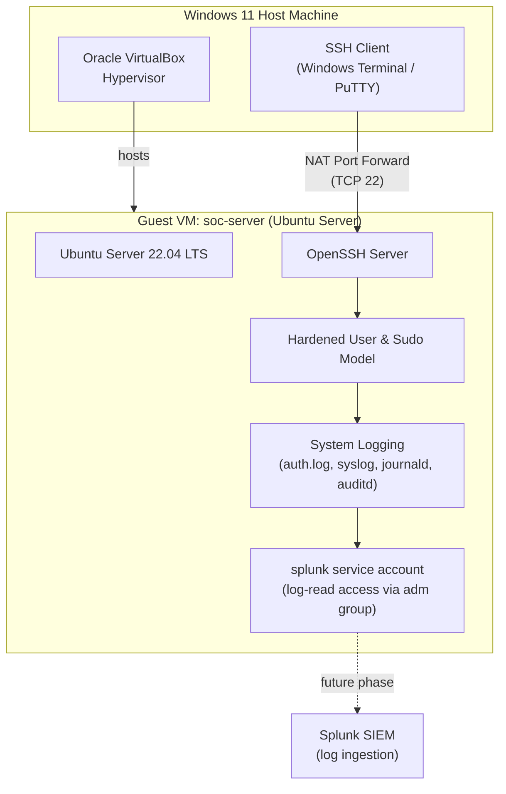

# SecureWatch Home SOC

---

## What This Project Is

SecureWatch Home SOC is a practice setup that copies what a real Security Operations Center uses. It runs on a secure Linux computer, allows safe remote access, collects all system logs in one place, and prepares those logs so they can be analyzed with a SIEM tool. The whole setup is built with free software: Oracle VirtualBox, Ubuntu Server, built‑in Linux logging tools, and Splunk. Everything runs inside a virtual lab on a Windows 11 computer.


## Architecture at a Glance



## Lab Environment

I built this home SOC lab on my Windows 11 computer using Oracle VirtualBox. Inside VirtualBox, I created an Ubuntu Server LTS virtual machine named `soc-server`.

To make administration easier, I configured NAT networking with SSH port forwarding so I can manage the server directly from my Windows terminal.

The main log sources used in this phase are:

- `auth.log`
- `syslog`
- `journald`
- `auditd`

These logs will later be forwarded to Splunk for monitoring and analysis.

## Project Roadmap

This project is divided into several phases. Each phase builds on the previous one as I gradually create a functional home Security Operations Center (SOC).

### Phase 1 – Infrastructure Foundation (Completed)
- Created the Ubuntu Server virtual machine.
- Configured the network.
- Installed and verified the operating system.

Documentation: [Phase 1](docs/phase-01/README.md)

---

### Phase 2 – Remote Administration (Completed)
- Installed and configured SSH.
- Enabled secure remote access from my Windows computer.
- Verified remote administration.

Documentation: [Phase 2](docs/phase-02/README.md)

---

### Phase 2.5 – Linux Server Hardening (Completed)
- Learned Linux users and groups.
- Configured sudo privileges.
- Managed file permissions.
- Applied basic password and account security.

Documentation: [Phase 2.5](docs/phase-02.5/README.md)

---

### Phase 3 – Logging & SIEM Preparation (Completed)
- Explored Linux log files.
- Configured `auditd`.
- Prepared the server for future Splunk integration.

Documentation: [Phase 3](docs/phase-03/README.md)

---

### Phase 4 – Detection & Alerting (Planned)
Next, I will connect the server to Splunk, create detection rules, and build dashboards.

---

### Phase 5 – Attack Simulation (Planned)
I will simulate realistic attacks against the lab to generate security events for analysis.

---

### Phase 6 – Incident Response (Planned)
Finally, I will investigate alerts, document findings, and create incident response reports.

## Repository Structure

```
SecureWatch-Home-SOC/
├── README.md                      
├── docs/
│   ├── phase-01/                  
│   │   ├── README.md
│   │   ├── architecture.md
│   │   ├── commands.md
│   │   └── troubleshooting.md
│   ├── phase-02/                 
│   │   ├── README.md
│   │   ├── architecture.md
│   │   ├── commands.md
│   │   └── troubleshooting.md
│   ├── phase-02.5/                
│   │   ├── README.md
│   │   ├── commands.md
│   │   └── hardening.md
│   └── phase-03/                  
│       ├── README.md
│       ├── architecture.md
│       ├── logging.md
│       ├── commands.md
│       └── troubleshooting.md
├── images/                        # Diagram exports (PNG/SVG)
├── drawio/                        # Editable draw.io source files
└── assets/                        # Supporting assets
```

## How to Use This Repository

Each phase folder is self-contained and follows the same structure: an overview and objectives, an architecture diagram, annotated commands with expected output, a troubleshooting log, and a "lessons learned" section. Start at Phase 1 and work forward — later phases assume the hardening and logging decisions made earlier.

## Skills Demonstrated

`Linux System Administration` · `SSH Hardening` · `Identity & Access Management` · `File Permissions & Ownership` · `sudo / Least Privilege` · `Linux Logging (syslog, journald, auditd)` · `SIEM Log Onboarding` · `Technical Documentation` · `Network Fundamentals (NAT, Port Forwarding)`

## Author

Built and documented as part of an ongoing home-lab SOC portfolio project.

---

*This repository is a living project. Phases 4–6 (SIEM detection, attack simulation, and incident response) are actively in progress.*
