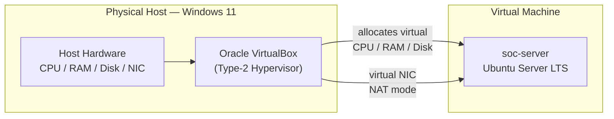
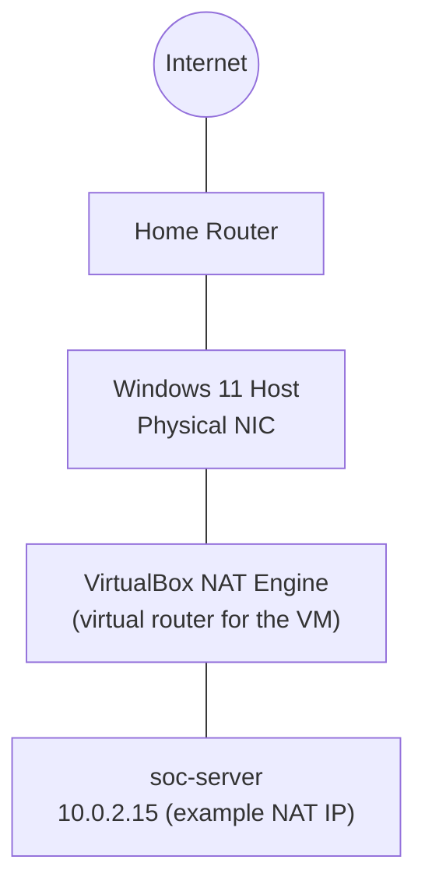

# Phase 1 — Architecture & Network Design

## Virtualization Architecture



A Type-2 hypervisor (VirtualBox) runs as an application on top of the host OS rather than directly on hardware. This is the appropriate model for a home lab: it requires no dedicated hardware, supports snapshotting for safe experimentation, and keeps the guest OS fully isolated from the host filesystem.

## Network Design



### Why NAT and Not Bridged Networking

| Mode | Guest Visibility on LAN | Use Case | Chosen? |
|---|---|---|---|
| NAT | Guest is hidden behind the host; not directly reachable from the LAN | Lab environments where the guest should reach *out* to the internet but not be reachable *from* other LAN devices | ✅ Yes |
| Bridged | Guest gets its own IP on the physical LAN, fully visible to other devices | Scenarios requiring the VM to act like a first-class device on the network | ❌ No |
| Host-Only | Guest can only talk to the host, no internet access | Fully isolated testing with no external connectivity | ❌ No (needed internet for updates) |

NAT was the correct choice for this phase because the goal was outbound connectivity (for updates and tool installation) without exposing `soc-server` to every other device on the home network by default. Inbound access (needed in Phase 2 for SSH) is handled deliberately through **port forwarding**, which only opens the specific port required rather than exposing the whole guest.

## System Baseline

Recording a system baseline early gives a reference point to detect unauthorized change later — the same principle a SOC uses when defining "normal" before it can detect "abnormal."

| Attribute | Baseline Value (example) |
|---|---|
| Hostname | `soc-server` |
| OS | Ubuntu Server 22.04 LTS |
| Kernel | `5.15.0-generic` (version at install time) |
| Primary disk | Single virtual disk, ext4 filesystem |
| Network mode | NAT |
| Default shell | `/bin/bash` |

## Folder Structure Established in Phase 1

```
soc-server:~$
├── projects/
│   └── securewatch-home-soc/
│       ├── notes/
│       ├── scripts/
│       └── configs/
```

This structure keeps lab-specific scripts and configuration snapshots separate from the rest of the home directory, which becomes important once later phases start generating config backups (SSH, auditd, sudoers) that need to be tracked over time.
