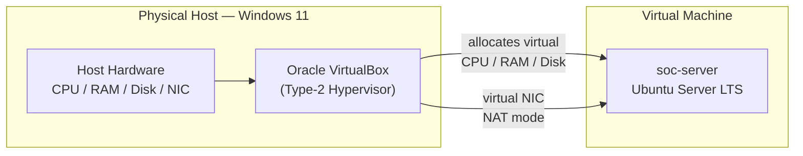
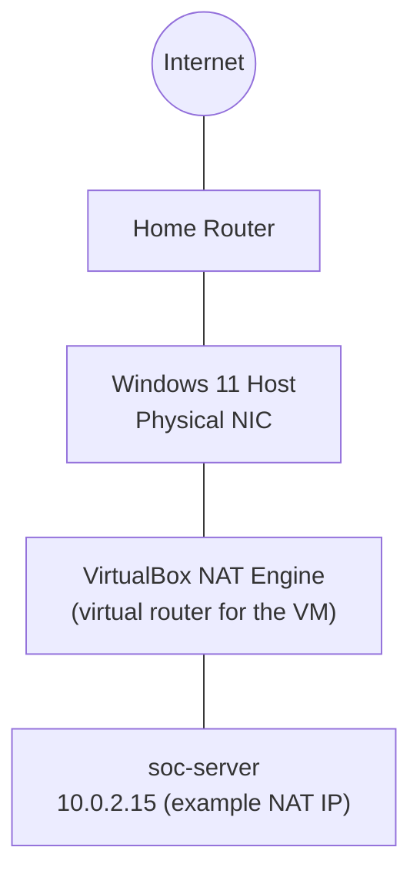

# Phase 1 - Architecture & Network Design

## Virtualization Architecture



VirtualBox is a Type 2 hypervisor that runs as an application on top of the host operating system instead of directly on the computer hardware. This model is suitable for a home lab because it does not need dedicated hardware, it allows snapshotting for safe testing, and it keeps the guest operating system completely separate from the host file system.

## Network Design



### Why NAT and Not Bridged Networking

NAT is used because it hides the guest system behind the host. Other devices on the local network cannot reach the guest directly, but the guest can still connect to the internet. This makes it ideal for a home lab where you want to test safely and still download updates.
Bridged networking gives the guest its own IP address on the local network, making it visible to other computers. That setup is useful only when the virtual machine needs to act like a normal device on the network, which is not needed here.
Host‑only networking allows the guest to talk only to the host and blocks internet access. It is good for complete isolation, but not suitable in this case because the guest needs internet access for updates.

NAT was the right choice at this stage because the goal was to give the guest system outbound access for updates and installing tools, without making `soc-server` visible to every device on the home network. When inbound access is needed later (for example, SSH in Phase 2), it is set up using port forwarding. This way only the required port is opened, instead of exposing the entire guest system.

## System Baseline

When you record a system baseline early, you capture the starting state of your server. This gives you a clear reference point so later you can notice if something changes without permission. It is the same idea a SOC uses: first define what “normal” looks like, then you can detect what is “abnormal.”

For this server, the baseline includes the following details:
- The hostname is soc-server.
- The operating system is `Ubuntu Server 22.04 LTS.`
- The kernel version at install time is `5.15.0-generic.`
- The primary disk is a single virtual disk using the ext4 filesystem.
- The network mode is NAT.
- The default shell is /bin/bash.

## Folder Structure Established in Phase 1

```
soc-server:~$
├── projects/
│   └── securewatch-home-soc/
│       ├── notes/
│       ├── scripts/
│       └── configs/
```

This structure keeps lab-specific scripts and configuration snapshots separate from the rest of the home directory, which becomes important once later phases start generating config backups (SSH, auditd, sudoers) that need to be tracked over time.
