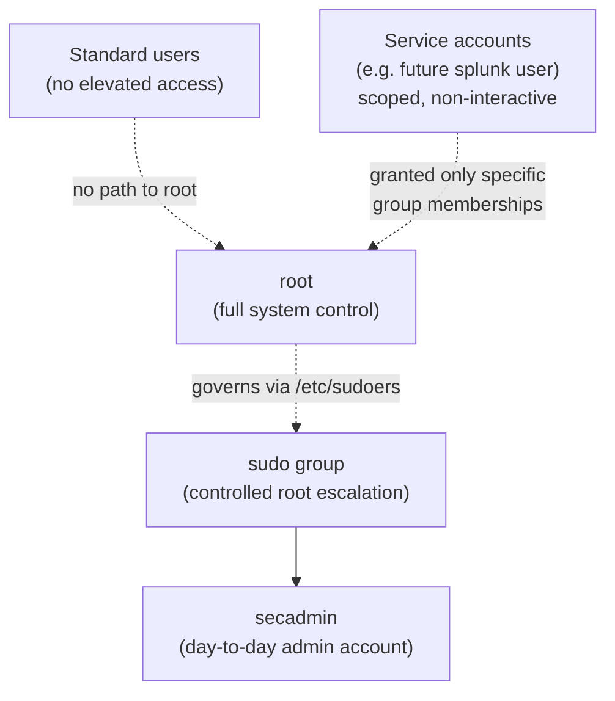

# Phase 2.5 — Hardening Deep Dive

## Identity & Access Model



The model established here follows a simple rule: **no account has more access than its job requires.** `secadmin` can *become* root for specific, logged actions via `sudo` — it does not *stay* root. Service accounts introduced in later phases (like the `splunk` user in Phase 3) get scoped group membership for a single purpose (reading logs) and nothing more.

## Permission Bits, Fully Explained

```
File type   Owner        Group        Others
   │        ┌─┴─┐        ┌─┴─┐        ┌─┴─┐
   -        r w x        r - x        - - -
   │        │ │ │        │ │ │        │ │ │
   │        │ │ └─execute│ │ └execute │ │ └─execute
   │        │ └───write  │ └──write   │ └───write
   │        └────read    └───read     └────read
```

| Numeric | Symbolic | Meaning |
|---|---|---|
| 7 | `rwx` | Read, write, execute |
| 6 | `rw-` | Read, write |
| 5 | `r-x` | Read, execute |
| 4 | `r--` | Read only |
| 0 | `---` | No access |

A permission set like `750` (owner: `rwx`, group: `r-x`, others: none) reads directly from these three digits — this numeric shorthand is what `chmod 750 file` actually sets.

## Ownership vs. Permissions — Two Different Questions

- **Ownership** (`chown`) answers: *who* is the designated owner (user) and owning group of this file?
- **Permissions** (`chmod`) answers: *what* can the owner, the group, and everyone else actually do with it?

A very common real-world mistake is fixing one without checking the other — for example, tightening permissions on a directory while it's still group-owned by the wrong team, which quietly reintroduces the same access problem through group membership instead of through the "others" bucket.

## sudo — Why It's Not Just "Root With Extra Steps"

Every `sudo` invocation is written to the system's authentication log (`/var/log/auth.log`), including the invoking user, the exact command run, and a timestamp. This logging is what makes `sudo` fundamentally different from shared root access: it creates an audit trail.

```
Jan  1 00:00:01 soc-server sudo: secadmin : TTY=pts/0 ; PWD=/home/secadmin ; USER=root ; COMMAND=/usr/bin/apt update
```

This single log line answers four questions any SOC investigation needs: **who** (`secadmin`), **from where** (`pts/0`), **what** (`apt update`), and **when** (timestamp). This log source becomes central in Phase 3.

## Password Policy Rationale

| Control | Value Set | Why |
|---|---|---|
| Maximum password age | 90 days | Limits the window a compromised-but-undetected password remains valid |
| Expiration warning | 7 days | Gives the user advance notice, reducing lockout risk from expired credentials |
| Account lockout after failed attempts (`faillock`/`pam_tally2`) | *(configured as a follow-up hardening step)* | Slows down online brute-force attempts against SSH/local login |

## Least Privilege Applied — Before vs. After

| Area | Before Hardening | After Hardening |
|---|---|---|
| Admin access | Default/root login used directly | Dedicated `secadmin` user with `sudo` |
| Unused accounts | Present, unreviewed | Reviewed, locked/removed as appropriate |
| Scripts directory permissions | Inherited default (often too permissive) | `750` — owner + group only |
| Password policy | None enforced | 90-day max age, 7-day warning |
| sudoers editing | N/A | Enforced via `visudo` only |

This before/after framing reflects how hardening is actually communicated in a real security assessment or audit report — not just "commands run," but a clear statement of risk reduced.
