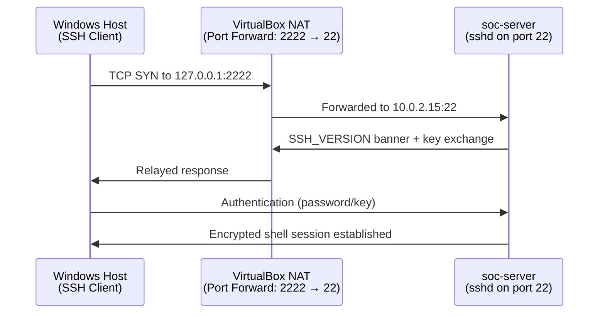

# Phase 2 - Remote Administration

## Overview

In this phase, I set up secure remote access to my Ubuntu Server using SSH. This allows me to manage the server directly from my Windows computer without using the VirtualBox console.

SSH is one of the most common tools used by Linux system administrators and SOC analysts to manage remote servers securely.

---

## Objectives

During this phase, I completed the following tasks:

- Installed the OpenSSH Server.
- Enabled the SSH service.
- Configured SSH to start automatically after reboot.
- Set up VirtualBox NAT port forwarding.
- Connected to `soc-server` from my Windows computer using SSH.
- Verified that remote administration was working correctly.

---

## Tools Used

The following tools were used during this phase:

- **OpenSSH Server** – Provides secure remote access to the Ubuntu Server.
- **systemd** – Used to manage and control the SSH service.
- **VirtualBox NAT Port Forwarding** – Allows the Windows host to connect to the virtual machine.
- **Windows SSH Client** – Used to connect to the Ubuntu Server from Windows.

---

## What is SSH?

SSH (Secure Shell) is a protocol that allows you to securely connect to another computer over a network. It encrypts the connection so that usernames, passwords, and commands are protected while they travel between the client and the server.

For Linux servers, SSH is the standard way to perform remote administration.

---

## Why This Matters

Most Linux servers are managed remotely instead of through a physical monitor and keyboard. Learning how to install, configure, and troubleshoot SSH is an important skill for system administrators and SOC analysts because it is used every day in real production environments.

## Connection Flow

See [architecture.md](architecture.md) for the full network and port-forwarding diagram.

## Step-by-Step Summary

1. Installed the OpenSSH server package on `soc-server`.
2. Verified the `sshd` service was active and enabled it to start automatically on boot.
3. Configured a VirtualBox NAT port-forwarding rule mapping a host port to the guest's port 22.
4. From the Windows host, connected to `soc-server` via SSH using the forwarded port.
5. Verified the session was established, encrypted, and behaving as expected.
6. Reviewed baseline `sshd_config` settings with security implications in mind (covered in depth in Phase 2.5's hardening work).

See [commands.md](commands.md) for the full command reference and [troubleshooting.md](troubleshooting.md) for issues encountered.

## Security Considerations

During this phase, I followed a few basic security practices:

- Only **SSH** was exposed for remote administration.
- I forwarded only the SSH port in VirtualBox instead of opening unnecessary ports.
- I started with **password authentication** to make sure the connection worked. In the next phase, I will improve security by setting up **SSH key authentication** and additional hardening.

## What I Learned

During this phase, I learned that:

- A service must be **started** before it can be used, and **enabled** if it should start automatically after a reboot.
- Port forwarding should be kept to a minimum to reduce unnecessary exposure.
- Keeping one SSH session open while testing another is a simple way to avoid accidentally locking yourself out of the server.

## Verification Checklist

-  `openssh-server` installed
-  `sshd` service active and enabled at boot
- NAT port-forwarding rule configured in VirtualBox
- Successful remote SSH login from Windows host
- Session confirmed encrypted (no plaintext fallback)

## References

- [OpenSSH Documentation](https://www.openssh.com/manual.html)
- [VirtualBox Port Forwarding Manual](https://www.virtualbox.org/manual/ch06.html#natforward)

## Next Phase

 [Phase 2.5 — Linux Server Hardening](../phase-02.5/README.md): now that the server can be reached remotely, the focus shifts to controlling exactly who can do what once they're in — users, groups, sudo, and permissions.
