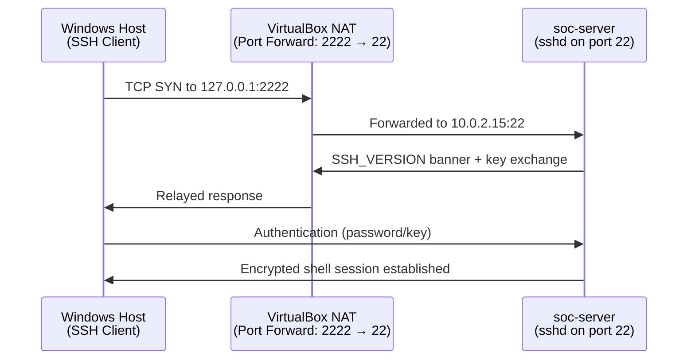

# Phase 2 — Remote Administration

## Overview

Real servers are rarely administered from a physical console — they live in racks, cloud regions, or in this case, inside a hypervisor with no monitor attached. Phase 2 establishes secure remote administration of `soc-server` from the Windows 11 host over SSH, which is the same mechanism used to manage virtually every Linux server in production environments.

This phase treats SSH not just as a convenience feature but as a security control in its own right: how it's configured determines whether remote administration is an asset or the single biggest attack surface on the box.

## Objectives

- Install and enable the OpenSSH server on `soc-server`
- Ensure the SSH service starts automatically on boot
- Configure VirtualBox NAT port forwarding so the Windows host can reach the guest's SSH port
- Connect to `soc-server` remotely from Windows and verify the session
- Understand and document the security implications of exposing a remote management service

## Technologies Used

| Tool | Purpose |
|---|---|
| OpenSSH Server (`openssh-server`) | Provides encrypted remote shell access to the VM |
| `systemd` | Manages the SSH service and its boot-time behavior |
| VirtualBox NAT Port Forwarding | Maps a port on the Windows host to port 22 on the guest |
| Windows SSH Client (OpenSSH / PuTTY) | Initiates the remote connection from the host |

## How SSH Works (Conceptually)

SSH (Secure Shell) establishes an encrypted channel between a client and a server. Unlike legacy protocols such as Telnet, which transmit credentials and session data in plaintext, SSH encrypts the entire session — including the login itself — using asymmetric key exchange to establish a shared session key, then symmetric encryption for the ongoing traffic. This is the foundational reason SSH is the standard for remote Linux administration: an attacker capturing SSH traffic on the wire sees encrypted noise, not credentials or commands.

## Why Remote Administration Matters for a SOC

A SOC analyst routinely needs to log into servers, jump boxes, and log-collection hosts that have no local console access. Demonstrating the ability to configure, harden, and troubleshoot SSH access — rather than just "clicking connect" — reflects the actual day-to-day reality of managing infrastructure remotely and securely.

## Connection Flow

See [architecture.md](architecture.md) for the full network and port-forwarding diagram.

## Step-by-Step Summary

1. Installed the OpenSSH server package on `soc-server`.
2. Verified the `sshd` service was active and enabled it to start automatically on boot.
3. Configured a VirtualBox NAT port-forwarding rule mapping a host port to the guest's port 22.
4. From the Windows host, connected to `soc-server` via SSH using the forwarded port.
5. Verified the session was established, encrypted, and behaving as expected.
6. Reviewed baseline `sshd_config` settings with security implications in mind (covered in depth in Phase 2.5's hardening work).

See [commands.md](commands.md) for the full command reference and [troubleshooting.md](troubleshooting.md) for issues encountered.

## Security Considerations

- **SSH is the single most exposed service in this lab.** Anything reachable from outside the box is a potential entry point, so its configuration deserves more scrutiny than almost any other service on the server.
- **Port forwarding scope:** Only port 22 (SSH) was forwarded — no other ports were opened. Minimizing forwarded ports keeps the exposed surface as small as possible.
- **Password authentication vs. key-based authentication:** Password auth was used initially to establish connectivity, with key-based authentication and further restrictions planned as part of the hardening work in Phase 2.5. Leaving password authentication enabled long-term on an internet-facing host is a known risk (susceptible to brute-force attacks); on this NAT-isolated lab the immediate exposure is limited, but the principle — key-based auth is stronger — still applies and is documented for anyone extending this lab to a publicly reachable environment.

## Lessons Learned

- Enabling a service (`systemctl enable`) is a distinct step from starting it (`systemctl start`) — conflating the two is a common misconfiguration that leaves a service unavailable after a reboot.
- NAT port forwarding is a deliberate, auditable choice: only the port that's actually needed should ever be forwarded, and each forwarded port should have a documented reason.
- Testing a new SSH configuration from a **second terminal session** while keeping the original session open prevents getting locked out if a config change breaks authentication — a habit carried forward into every later hardening step.

## Verification Checklist

- [x] `openssh-server` installed
- [x] `sshd` service active and enabled at boot
- [x] NAT port-forwarding rule configured in VirtualBox
- [x] Successful remote SSH login from Windows host
- [x] Session confirmed encrypted (no plaintext fallback)

## References

- [OpenSSH Documentation](https://www.openssh.com/manual.html)
- [VirtualBox Port Forwarding Manual](https://www.virtualbox.org/manual/ch06.html#natforward)

## Next Phase

➡️ [Phase 2.5 — Linux Server Hardening](../phase-02.5/README.md): now that the server can be reached remotely, the focus shifts to controlling exactly who can do what once they're in — users, groups, sudo, and permissions.
