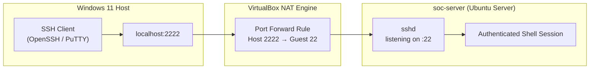
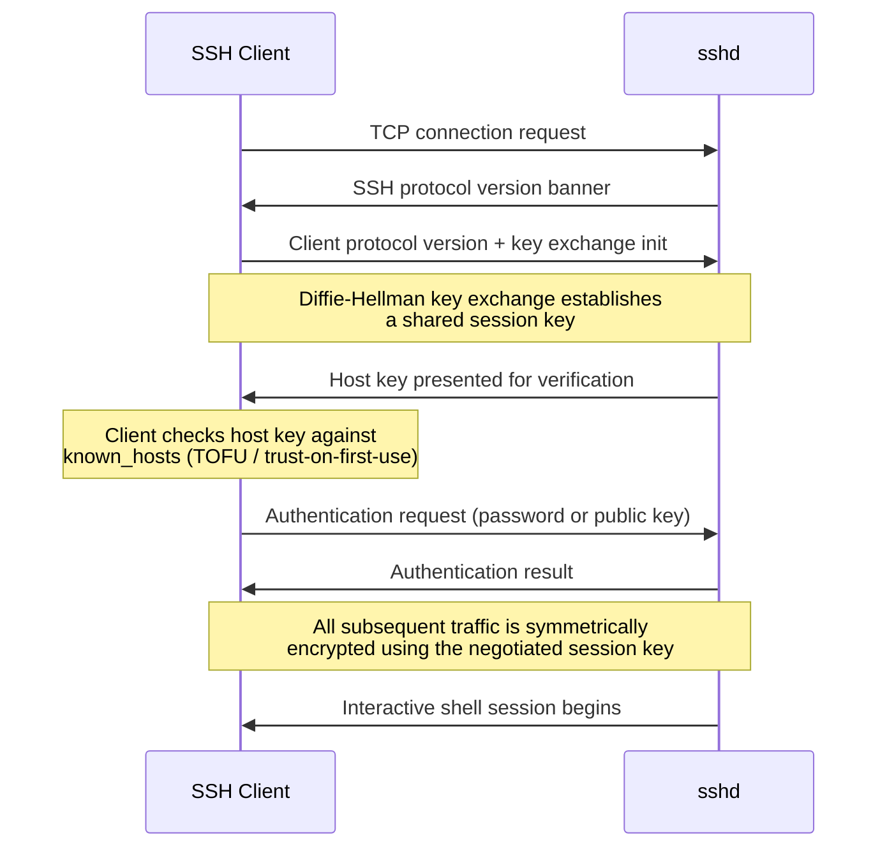
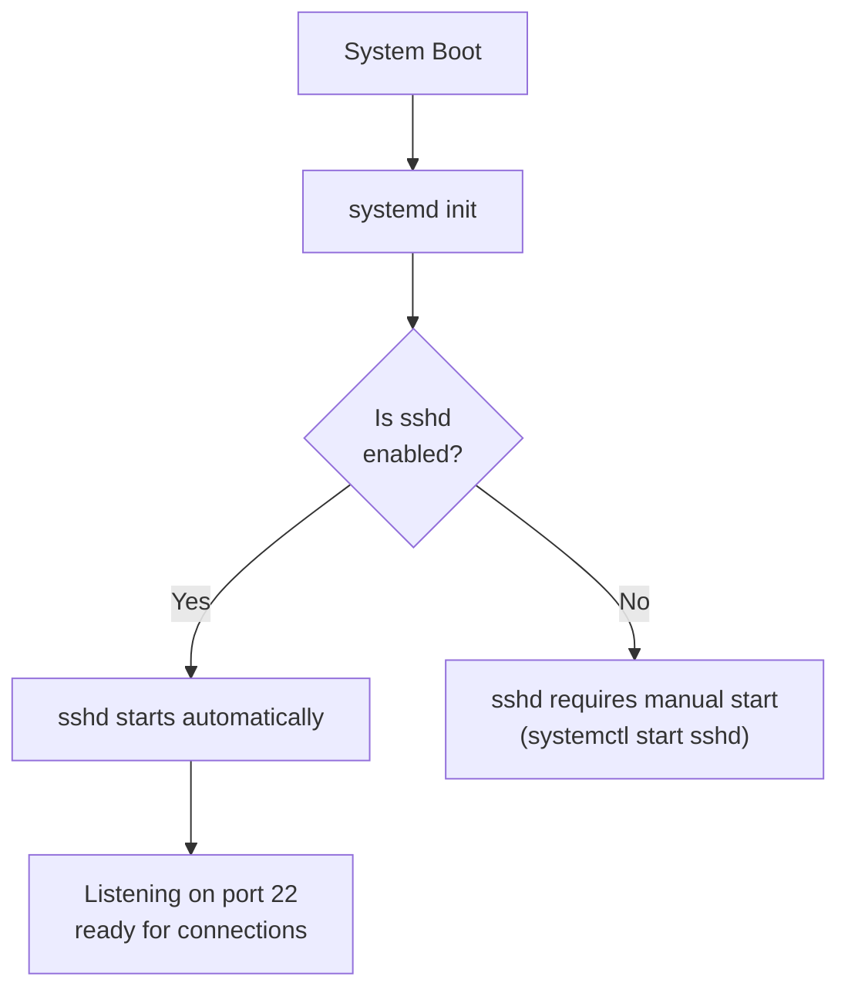

# Phase 2 - Architecture & Connection Design

## Network Path: Windows Host -> soc-server

## Why I Used Port Forwarding

In Phase 1, I chose **NAT networking** to keep the Ubuntu Server isolated from my home network. However, NAT also means I can't connect directly to the virtual machine from Windows.

To solve this, I configured **port forwarding** in VirtualBox. This forwards only the SSH port from my Windows computer to the Ubuntu Server, allowing me to connect securely using SSH.

This approach lets me manage the server remotely while keeping the rest of the virtual machine hidden from my home network.

## Port Forwarding Rule

| Name | Protocol | Host IP | Host Port | Guest IP | Guest Port |
|---|---|---|---|---|---|
| SSH | TCP | 127.0.0.1 | 2222 | (guest NAT IP) | 22 |

By setting the host IP to `127.0.0.1`, the forwarded SSH port can only be accessed from my Windows computer. Other devices on my home network cannot connect to it, which helps keep the virtual machine isolated and follows the security approach established in Phase 1.

## SSH Session Establishment (Detailed)

## Host Key Verification

The first time I connected to the Ubuntu Server using SSH, Windows asked me to confirm the server's identity by displaying its host key fingerprint.
After accepting it, the fingerprint is saved on my computer. Future SSH connections compare the saved fingerprint with the server's current fingerprint. If they don't match, SSH displays a warning because the server's identity may have changed.
This helps protect against connecting to the wrong server or a malicious system pretending to be the real one.

## Service Boot Behavior

`systemctl enable` creates the symlinks that tell `systemd` to start the service at boot; `systemctl start` starts it for the current session only. Both were required to ensure `soc-server` is remotely reachable immediately after every reboot without manual intervention — critical for a server that, in a real deployment, might not have console access at all.
