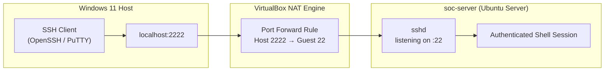
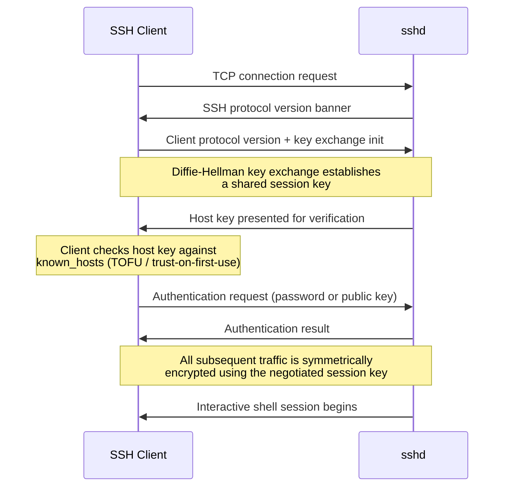
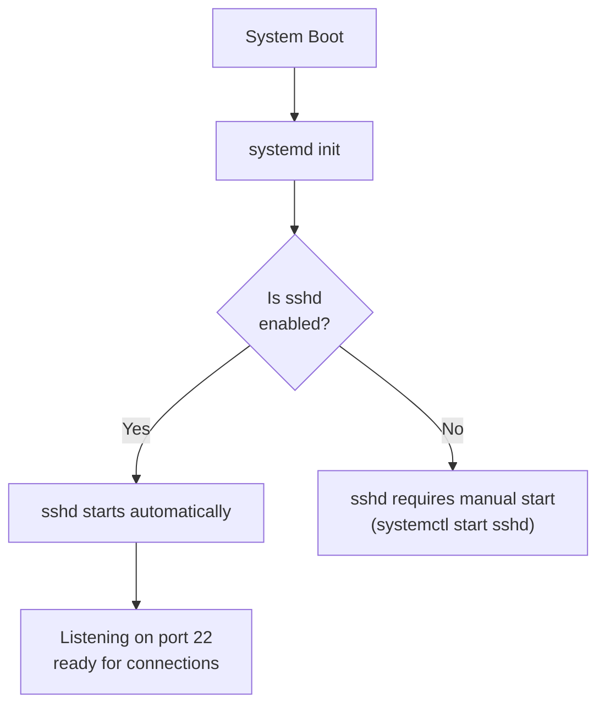

# Phase 2 — Architecture & Connection Design

## Network Path: Windows Host → soc-server

## Why Port Forwarding Instead of Bridged Networking

Phase 1 established NAT mode specifically because it hides the guest from the rest of the home LAN. That decision creates a natural question for Phase 2: if the guest is hidden, how does the host reach it for SSH?

The answer is **targeted port forwarding** — instead of exposing the entire guest to the network (which Bridged mode would do), only a single, specific port (SSH, 22) is mapped from the host to the guest, and only the host itself can reach it via `localhost`. This preserves the isolation benefits of NAT while still enabling remote administration. It's the same principle used in production environments with bastion hosts or jump boxes: expose the smallest possible surface required for the job.

## Port Forwarding Rule

| Name | Protocol | Host IP | Host Port | Guest IP | Guest Port |
|---|---|---|---|---|---|
| SSH | TCP | 127.0.0.1 | 2222 | (guest NAT IP) | 22 |

Binding the host side to `127.0.0.1` (rather than `0.0.0.0`) ensures the forwarded port is only reachable from the host machine itself — not from other devices on the home network — reinforcing the same isolation principle established in Phase 1.

## SSH Session Establishment (Detailed)

**Key security concept — host key verification:** The first time a client connects to a new SSH server, it's presented with the server's host key fingerprint and asked to confirm it. This is what prevents a class of attack where a malicious host silently impersonates the real server (a man-in-the-middle). Accepting a host key blindly defeats this protection — the fingerprint should be verified out-of-band whenever possible, especially outside a lab environment.

## Service Boot Behavior

`systemctl enable` creates the symlinks that tell `systemd` to start the service at boot; `systemctl start` starts it for the current session only. Both were required to ensure `soc-server` is remotely reachable immediately after every reboot without manual intervention — critical for a server that, in a real deployment, might not have console access at all.
