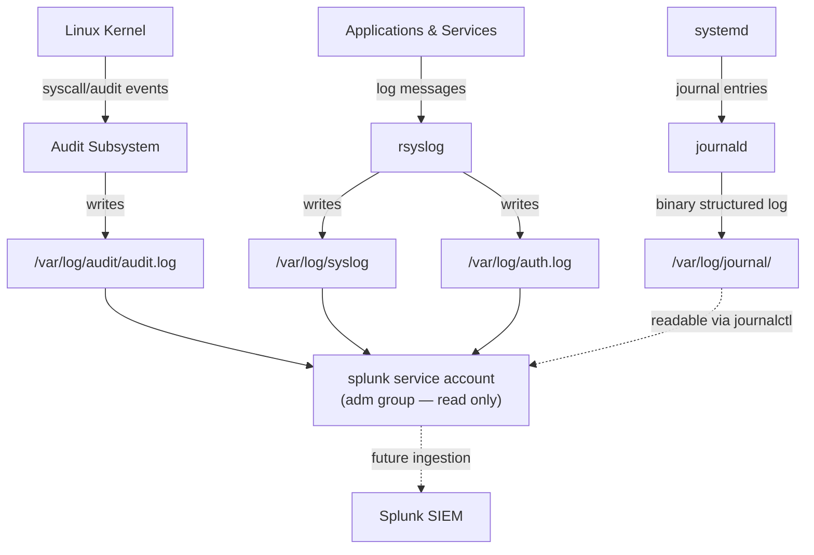
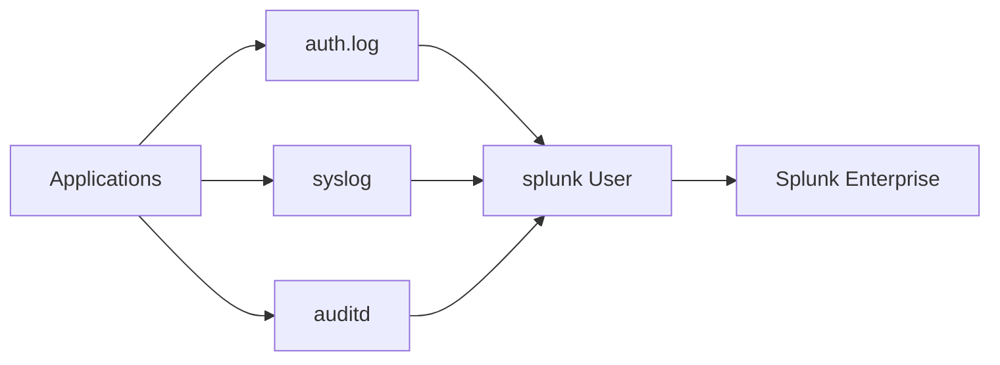

# Phase 3 - Logging & SIEM Preparation

## Overview

In this phase, I prepared my Ubuntu Server for log collection and SIEM integration.

I explored the different types of system logs, installed and configured `auditd`, and prepared Splunk to read system logs. I also made sure the `splunk` service account had permission to read the required log files without giving it unnecessary administrative privileges.

This phase builds the foundation for collecting and analyzing security events in the next stages of the project.

---

## Objectives

During this phase, I completed the following tasks:

- Explored the default Linux log files.
- Learned how system logs are generated and stored.
- Installed and configured `auditd`.
- Installed Splunk Enterprise.
- Created the `splunk` service account.
- Granted the `splunk` account access to read system logs.
- Verified that Splunk could access the required log files.

---

## Tools Used

The following tools were used during this phase:

- **auth.log** – Records login attempts, SSH activity, and `sudo` commands.
- **syslog** – Stores general system events.
- **journalctl** – View systemd logs.
- **auditd** – Records security-related events.
- **Splunk Enterprise** – Collects and analyzes log data.
- **adm Group** – Allows the Splunk service account to read system logs.

## How Linux Logging Works — The Big Picture

See [architecture.md](architecture.md) for the full diagram and [logging.md](logging.md) for a detailed breakdown of each log source.

## Logging Overview

In this phase, I explored how Ubuntu stores system logs and prepared the server for Splunk.

I installed `auditd`, reviewed important log files, and made sure the `splunk` service account could read the required logs without giving it unnecessary administrator privileges.

---

## Architecture

This is much easier to understand than the previous diagram.

---

## Log Files

| Log File | Purpose |
|----------|---------|
| `auth.log` | Login attempts, SSH activity, and `sudo` commands |
| `syslog` | General system messages |
| `journalctl` | View logs managed by systemd |
| `auditd` | Security audit events |

---

## What I Did

During this phase, I:

- Reviewed Linux system logs.
- Installed and started `auditd`.
- Installed Splunk Enterprise.
- Created the `splunk` service account.
- Added the `splunk` user to the `adm` group.
- Verified that the `splunk` account could read the required log files.

---

## Why I Used the `adm` Group

The `splunk` account only needs to read log files.

Instead of giving it administrator access, I added it to the `adm` group so it could read the logs needed by Splunk while keeping the account's permissions limited.

---

## Security Considerations

During this phase, I followed these security practices:

- Gave the `splunk` account only the permissions it needed.
- Avoided giving the `splunk` account `sudo` access.
- Verified that system logs could be read before moving to the next phase.

---

## What I Learned

This phase helped me understand that:

- Linux stores different events in different log files.
- `auditd` records security-related events.
- Splunk only needs permission to read log files.
- Giving services only the permissions they need helps improve security.

---

## Verification

Before moving to the next phase, I confirmed that:

- `auditd` was installed and running.
- System log files were available.
- Splunk Enterprise was installed.
- The `splunk` account was created.
- The `splunk` account could read the required log files.

## References

- [auditd Documentation — Linux Audit Framework](https://github.com/linux-audit/audit-documentation)
- [systemd journald man page](https://www.freedesktop.org/software/systemd/man/journald.conf.html)
- [Splunk — Getting Data In (Universal Forwarder)](https://docs.splunk.com/Documentation/Splunk/latest/Data/Whatsyourdatasource)

## Next Phase

Phase 4 — Detection & Alerting : with logs flowing and access correctly scoped, the next phase moves into actually ingesting these sources into Splunk and building detection content around them.
