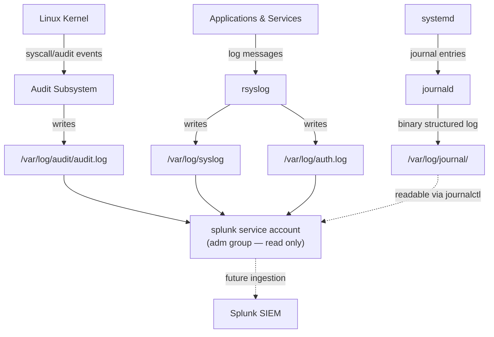

# Phase 3 — Logging & SIEM Preparation

## Overview

A SOC without logs isn't a SOC — it's guesswork after the fact. Phase 3 builds the logging foundation that every later detection and response capability in this project depends on: understanding what Linux logs by default, enabling deeper auditing with `auditd`, and — critically — preparing those logs to be safely and correctly ingested by a SIEM (Splunk) without over-granting access to get there.

This phase is where the hardening work from Phase 2.5 directly pays off: the same least-privilege thinking applied to human admin accounts is now applied to a *service account* that exists purely to read logs.

## Objectives

- Understand Ubuntu's native logging stack: `auth.log`, `syslog`, `journald`, and `auditd`
- Install and configure `auditd` for deeper, rule-based system auditing
- Create a dedicated, non-privileged `splunk` service account
- Grant that account read access to system logs via the `adm` group — without granting shell/administrative privileges
- Verify log readability from the `splunk` account's perspective
- Document the full log flow from generation to (future) SIEM ingestion

## Technologies Used

| Tool | Purpose |
|---|---|
| `rsyslog` | Traditional syslog daemon, source of `/var/log/syslog` and related logs |
| `auth.log` | Records authentication events — logins, `sudo` usage, SSH sessions |
| `journald` | systemd's structured, binary logging system |
| `auditd` | Linux Audit Daemon — rule-based, kernel-level auditing of specific events (file access, syscalls, etc.) |
| `adm` group | Built-in Linux group traditionally granted read access to system logs |
| Splunk (prep only) | Target SIEM platform this phase prepares logs to feed into |

## How Linux Logging Works — The Big Picture

See [architecture.md](architecture.md) for the full diagram and [logging.md](logging.md) for a detailed breakdown of each log source.

## Log Sources at a Glance

| Log Source | Location | What It Captures |
|---|---|---|
| `auth.log` | `/var/log/auth.log` | Login attempts, `sudo` usage, SSH sessions, PAM events |
| `syslog` | `/var/log/syslog` | General system and application messages |
| `journald` | `/var/log/journal/` (binary) | Structured logs from `systemd`-managed services; queried via `journalctl` |
| `auditd` | `/var/log/audit/audit.log` | Rule-based, kernel-level events — file access, command execution, security-relevant syscalls |

## Step-by-Step Summary

1. Reviewed existing default log sources (`auth.log`, `syslog`) already being generated by the system.
2. Installed and enabled `auditd` for rule-based auditing beyond what syslog captures by default.
3. Created a dedicated `splunk` service account intended purely for log collection — not interactive administrative use.
4. Added the `splunk` account to the `adm` group, which has built-in read access to most system logs on Debian/Ubuntu systems.
5. Verified, from the `splunk` account's own session, that it could read the relevant log files but had no broader system privileges.
6. Documented the full log flow and the reasoning behind every permission granted.

Full commands are in [commands.md](commands.md); the deeper explanation of each log type and why a SIEM needs them is in [logging.md](logging.md); issues encountered are in [troubleshooting.md](troubleshooting.md).

## Why a SIEM Needs These Logs

A SIEM's entire value proposition is correlation: connecting a failed SSH login in `auth.log`, an unusual `sudo` command, and a suspicious process launch recorded by `auditd` into a single, timestamped narrative that a human analyst can act on. None of that correlation is possible without reliable, complete, and *trustworthy* log ingestion — which is why the permission model for the account doing that ingestion matters just as much as the logs themselves.

## Why Permissions Matter Here Specifically

The `splunk` service account is a textbook case for least privilege: it needs to **read** log files, and that is the entire scope of its job. It does not need:
- Shell login capability for interactive use
- `sudo` privileges
- Write access to the logs it reads (write access would let a compromised collector account tamper with the very evidence it's supposed to be preserving)

Granting it membership in the `adm` group — rather than adding it to `sudo`, or worse, running the log collector as `root` — satisfies the actual requirement (read access to logs) without introducing unnecessary risk. If the Splunk forwarder process were ever compromised, the blast radius is limited to "can read logs," not "can do anything on this server."

## Security Considerations

- **Read-only log access** for the collection account preserves log integrity — a critical property for any log data that might later support an incident investigation.
- **Service accounts should not have interactive login** unless a specific reason requires it; a locked shell (`/usr/sbin/nologin`) is appropriate for a pure log-forwarding account.
- **`auditd` rule scope matters** — auditing everything indiscriminately produces noise that buries real signal and can also generate significant log volume; rules should target security-relevant events specifically.

## Lessons Learned

- The `adm` group's existence is itself a lesson in the Linux permission model applied at scale: rather than granting individual read permissions on dozens of log files to every account that needs log access, Debian/Ubuntu ship a purpose-built group for exactly this use case.
- `journald`'s binary format means it can't just be `cat`-ed like a traditional text log — it requires `journalctl`, which matters when planning how a SIEM forwarder will actually ingest it.
- Building the log pipeline *before* the SIEM exists (rather than bolting on permissions after the fact) forces a cleaner, more deliberate security design — it's much easier to grant exactly the right access up front than to unwind over-broad access later.

## Verification Checklist

- [x] `auditd` installed, enabled, and running
- [x] Default log sources (`auth.log`, `syslog`) reviewed and understood
- [x] Dedicated `splunk` service account created
- [x] `splunk` account added to `adm` group
- [x] Log read access verified from the `splunk` account's session
- [x] `splunk` account confirmed to have no unnecessary privileges (no `sudo`, no interactive shell requirement)

## References

- [auditd Documentation — Linux Audit Framework](https://github.com/linux-audit/audit-documentation)
- [systemd journald man page](https://www.freedesktop.org/software/systemd/man/journald.conf.html)
- [Splunk — Getting Data In (Universal Forwarder)](https://docs.splunk.com/Documentation/Splunk/latest/Data/Whatsyourdatasource)

## Next Phase

➡️ Phase 4 — Detection & Alerting *(planned)*: with logs flowing and access correctly scoped, the next phase moves into actually ingesting these sources into Splunk and building detection content around them.
