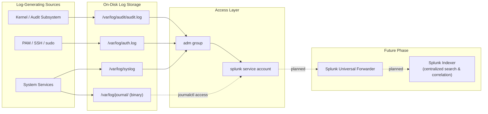
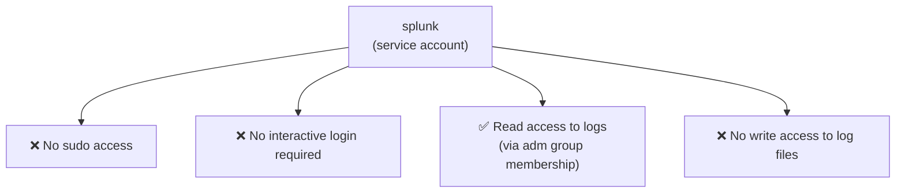
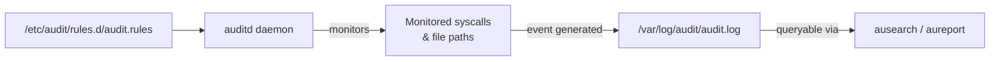

# Phase 3 — Architecture & Log Flow

## End-to-End Log Flow

## Access Model for the `splunk` Service Account

This is the direct, practical application of least privilege introduced in Phase 2.5: the account exists to do exactly one job — read logs — and every other capability is deliberately withheld.

## Why `adm` Group Membership Instead of Direct File Permissions

An alternative approach would be granting the `splunk` account explicit read permissions (`setfacl` / individual `chmod` adjustments) on each log file directly. Using the built-in `adm` group instead is preferable for a few reasons:

1. **It's the standard, well-understood mechanism** on Debian/Ubuntu systems — any future admin (or auditor) reviewing this system will immediately recognize what `adm` membership implies.
2. **It scales automatically.** New log files created under `/var/log/` by standard system logging tools typically inherit group ownership that's already readable by `adm`, without needing a new permission grant for every new log file.
3. **It keeps the permission model auditable.** `groups splunk` gives a complete, one-command answer to "what can this account read," rather than requiring a search across ACLs on individual files.

## auditd Rule Flow

`auditd` operates on explicit rules — unlike `syslog`, which passively receives whatever messages applications choose to send, `auditd` is told exactly which files, directories, or syscalls to watch. This makes it well suited for targeted, security-relevant monitoring (e.g., watching `/etc/passwd` for unexpected modifications) without generating the noise of logging every system event indiscriminately.

## Log Source Comparison Matrix

| Log Source | Format | Captures | Queried With | Persistent by Default? |
|---|---|---|---|---|
| `auth.log` | Plaintext | Authentication events | `cat`, `grep`, `tail` | Yes |
| `syslog` | Plaintext | General system messages | `cat`, `grep`, `tail` | Yes |
| `journald` | Binary, structured | systemd service logs | `journalctl` | Depends on config (`Storage=` in `journald.conf`) |
| `auditd` | Plaintext (structured fields) | Rule-defined security events | `ausearch`, `aureport` | Yes |
