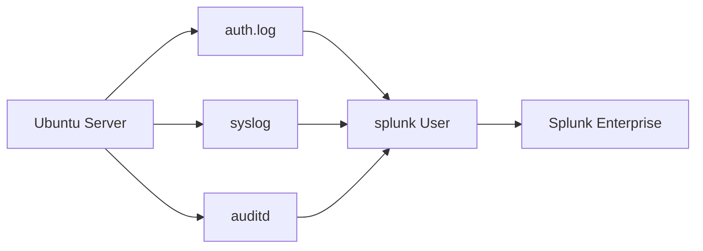

# Phase 3 - Architecture

## Log Flow

## How Log Collection Works

1. Ubuntu Server generates system logs.
2. Logs are stored in files such as `auth.log`, `syslog`, and `auditd`.
3. The `splunk` service account has permission to read these logs.
4. Splunk Enterprise will use these logs for monitoring and analysis.

## Architecture Summary

| Component | Purpose |
|----------|---------|
| Ubuntu Server | Generates system logs |
| auth.log | Records login and authentication events |
| syslog | Stores general system messages |
| auditd | Records security-related events |
| splunk User | Reads log files |
| Splunk Enterprise | Collects and analyzes logs |

## What I Learned

This phase helped me understand that:

- Linux stores different types of events in different log files.
- Splunk needs permission to read these log files.
- Giving only the required permissions is more secure than giving administrator access.
