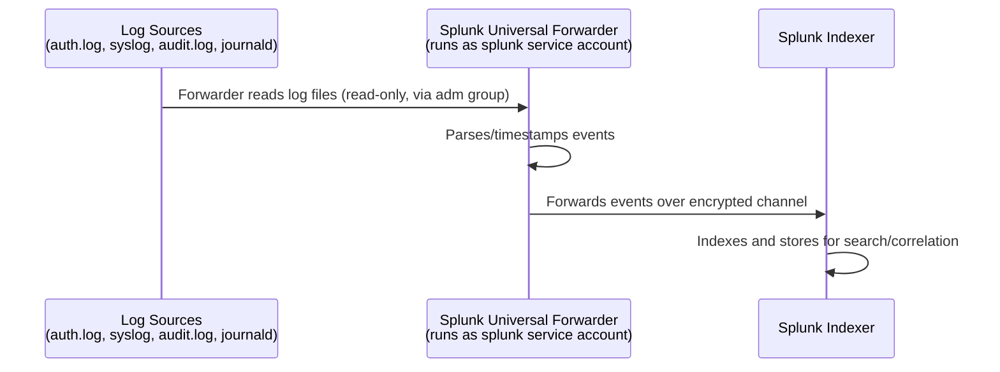

# Phase 3 — Linux Logging Deep Dive

## `auth.log` — Authentication & Authorization Events

**Location:** `/var/log/auth.log`

Records every authentication-relevant event on the system: SSH login attempts (successful and failed), `sudo` invocations, PAM module activity, and user/group management actions.

**Example entries:**
```
Jan  1 00:00:01 soc-server sshd[1234]: Accepted password for secadmin from 10.0.2.2 port 51500 ssh2
Jan  1 00:00:05 soc-server sudo: secadmin : TTY=pts/0 ; PWD=/home/secadmin ; USER=root ; COMMAND=/usr/bin/apt update
Jan  1 00:05:12 soc-server sshd[1250]: Failed password for invalid user admin from 203.0.113.44 port 41022 ssh2
```

**Why it matters to a SOC:** This is often the single most valuable log source for detecting brute-force attempts, credential stuffing, and privilege escalation activity — repeated `Failed password` entries from the same source, especially for usernames that don't exist (`invalid user`), are a classic early indicator of an attack in progress.

---

## `syslog` — General System Messages

**Location:** `/var/log/syslog`

The general-purpose log stream for system and application messages that don't have a more specific dedicated log — package management events, kernel messages, cron job execution, and output from many system services.

**Example entry:**
```
Jan  1 00:10:00 soc-server CRON[2001]: (root) CMD (/usr/local/bin/backup.sh)
```

**Why it matters to a SOC:** Provides broader system context around an event — useful for correlating "what else was happening on the box" around the time of a suspicious `auth.log` entry.

---

## `journald` — Structured, Binary systemd Logging

**Location:** `/var/log/journal/` (binary format, not human-readable directly)

Unlike `auth.log` and `syslog`, which are plaintext, `journald` stores structured, indexed, binary log data for every `systemd`-managed unit. It captures the same category of events as syslog but with richer metadata (unit name, process ID, boot ID) and much faster querying.

**Querying journald:**
```bash
journalctl -u ssh.service --since "1 hour ago"
```

**Example output:**
```
Jan 01 00:00:01 soc-server sshd[1234]: Accepted password for secadmin from 10.0.2.2 port 51500 ssh2
```

**Why it matters to a SOC:** Its structured nature makes it well-suited to programmatic ingestion — the metadata fields (unit, PID, boot ID) give a SIEM more to filter and correlate on than a flat text line alone.

---

## `auditd` — Rule-Based Kernel-Level Auditing

**Location:** `/var/log/audit/audit.log`

`auditd` is fundamentally different from the other three sources: instead of passively logging whatever applications choose to report, it actively monitors specific, configured events at the kernel level — file access, syscall execution, and more — based on explicit rules.

**Example rule (watch for changes to the password file):**
```bash
sudo auditctl -w /etc/passwd -p wa -k passwd_changes
```
- `-w /etc/passwd` — watch this specific file
- `-p wa` — trigger on **w**rite or **a**ttribute-change events
- `-k passwd_changes` — tag matching events with a searchable key

**Example resulting log entry:**
```
type=PATH msg=audit(1735689600.123:456): item=0 name="/etc/passwd" inode=... key="passwd_changes"
```

**Querying by key:**
```bash
sudo ausearch -k passwd_changes
```

**Why it matters to a SOC:** `auditd` catches activity that syslog-based tools simply don't record by default — for example, a user other than root editing `/etc/passwd`, or an unexpected process reading a sensitive file. This is the closest thing in this stack to true security-focused monitoring, as opposed to general operational logging.

---

## Difference Summary

| Question | `auth.log` | `syslog` | `journald` | `auditd` |
|---|---|---|---|---|
| What triggers an entry? | Authentication-related events | General system/app messages | Any systemd unit activity | Rules explicitly configured by the admin |
| Format | Plaintext | Plaintext | Binary, structured | Plaintext, structured fields |
| Primary SOC use case | Brute-force / login anomaly detection | General correlation context | Rich per-service investigation | Targeted security event detection |
| Configurable granularity | Low (fixed set of events) | Low | Medium (per-unit) | High (fully rule-driven) |

## How Logs Move Toward SIEM Ingestion (Planned)



This phase completes the "read-only, least-privilege access" half of that diagram. The forwarder installation and indexer configuration are the subject of the planned Phase 4.
