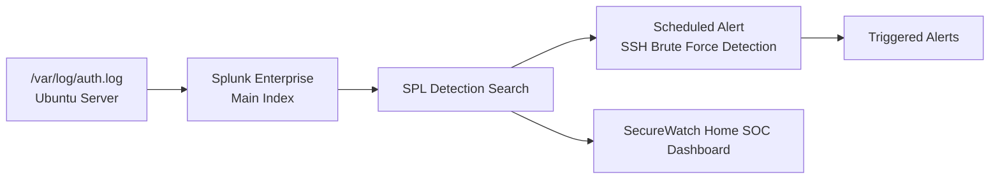

# Phase 4 - Detection & Alerting

## Overview

After preparing the server and logging infrastructure in the previous phases, this phase focuses on transforming collected log data into actionable security monitoring using Splunk.

Rather than manually reviewing log files, I configured Splunk to ingest authentication logs, explored them using Splunk Search Processing Language (SPL), and built a detection for repeated SSH authentication failures. Finally, I generated test events to validate that the detection worked as expected.

This phase represents the transition from simply collecting logs to actively monitoring the system for suspicious behavior—the primary purpose of any Security Information and Event Management (SIEM) platform.

---

## Objectives

During this phase I:

- Configured Splunk to ingest Linux authentication logs.
- Verified incoming events inside Splunk Search.
- Learned basic Splunk Search Processing Language (SPL).
- Built a detection for repeated failed SSH logins.
- Converted the detection into a Splunk alert.
- Simulated SSH brute-force attempts to validate the alert.
- Documented the complete detection workflow.

See `commands.md` for the complete command reference, `architecture.md` for the detection pipeline, and `troubleshooting.md` for issues encountered during configuration.

## Tasks Completed

During this phase, I completed the following tasks:

- Verified that Linux authentication events from `/var/log/auth.log` were successfully indexed in Splunk.
- Used progressively refined SPL searches, starting with broad searches (`index=*`) and narrowing them to SSH authentication events.
- Investigated `sshd` events, including successful logins, failed logins, session creation, session termination, and daemon startup messages.
- Built an SPL query to detect repeated failed SSH password authentication attempts and extracted the source IP address for analysis.
- Saved the search as a **Scheduled Alert** named **SSH Brute Force Detection** with **High** severity.
- Simulated failed SSH login attempts and verified that the alert triggered successfully.
- Built a **SecureWatch Home SOC Dashboard** to visualize:
  - Failed SSH login attempts
  - Source IP address frequency
  - Successful SSH login activity
- Correlated successful SSH logins with related authentication events (such as `sudo`) to distinguish legitimate administrator activity from suspicious authentication attempts.

## Architecture 



## Step-by-Step Summary

1. Verified that Linux authentication events were successfully indexed in Splunk by performing a broad search (`index=*`). This confirmed that log ingestion was working before creating more specific searches.

2. Narrowed the search scope to Linux authentication logs (`/var/log/auth.log`) to focus the investigation on SSH-related activity.

3. Reviewed the indexed authentication events to understand the different event types present, including successful SSH logins, failed login attempts, `sudo` activity, session creation, session termination, and other authentication-related messages.

4. Refined the search to display only `sshd` events, isolating SSH authentication activity from unrelated system events.

5. Built an SPL detection query that identifies failed SSH password authentication attempts and extracts the source IP address into a dedicated field using the `rex` command for easier analysis.

6. Saved the detection as a **Scheduled Alert** named **SSH Brute Force Detection**, configured with **High** severity to automatically notify when the detection criteria are met.

7. Simulated failed SSH login attempts and confirmed that the detection successfully generated alerts by verifying entries on the **Triggered Alerts** page.

8. Built the **SecureWatch Home SOC Dashboard** to visualize authentication activity, including:
   - Failed SSH login attempts
   - Successful SSH logins
   - Top source IP addresses responsible for failed login attempts
   - Authentication trends over time

## SPL Queries

### 1. Initial Broad Search (Sanity Check)

```spl
index=* "Failed password"
```

**Purpose:** Before building anything specific, this confirms that across every index Splunk has access to  that failed-password events exist at all. This is a deliberately unscoped, "does the data exist somewhere" query, useful as the very first step whenever building a new detection: prove the raw data is there before narrowing.


*Screenshot: initial `index=* "Failed password"` search over a 30-day window, confirming failed-password events are being indexed before scoping the search further.*

---

### 2. Scoping to the Correct Log Source

```spl
index=main source="/var/log/auth.log"
```

**Purpose:** Once confirmed the data exists, the search is scoped down to the exact index (`main`, the default index events land in) and exact source file (`/var/log/auth.log`) relevant to SSH authentication. Scoping early avoids wading through irrelevant data from other sources later.


*Screenshot: the base query `index=main source="/var/log/auth.log"` used as the foundation for every subsequent, more specific search in this phase.*

---

### 3. Reviewing All Events From the Source

Running the scoped query above over a wider window returned 60 events, including `sudo` session activity, `su` session activity, and unrelated application noise (e.g., a `mongod` plugin-lookup error that happened to be captured in the same log stream).


*Screenshot: full event listing from `index=main source="/var/log/auth.log"` (60 events), used to understand the real mix of event types present in the log before narrowing the search further.*

**Why this step matters:** A log source rarely contains only the event type you're looking for. Reviewing the unfiltered event list first prevents writing a detection query that accidentally matches on the wrong thing, and surfaces "noise" events early rather than discovering them later as false positives.

---

### 4. Isolating SSH-Specific Events

```spl
index=main source="/var/log/auth.log" sshd
```

**Purpose:** Adding the `sshd` keyword filters the log down to lines actually generated by the SSH daemon that accepted/failed password attempts, session open/close events, and listener startup banners — separating them from `sudo`, `su`, and cron activity that shares the same file.


*Screenshot: `index=main source="/var/log/auth.log" sshd` over the last 24 hours (10 events), showing a full SSH session lifecycle — listener startup, accepted password, session open, session close.*


*Screenshot: the same `sshd`-filtered query over a narrower time window (4 events), used to confirm the query behaved consistently and returned only genuine SSH daemon activity.*

**Event types observed in these results:**

| Event Fragment | Meaning |
|---|---|
| `sshd[####]: Server listening on :: port 22.` / `on 0.0.0.0 port 22.` | The SSH daemon started and bound to both IPv6 and IPv4 |
| `sshd-session[####]: Accepted password for <user> from <ip> port <port> ssh2` | A successful password authentication |
| `pam_unix(sshd:session): session opened for user <user>(uid=####) by <user>(uid=0)` | PAM confirming the session was established |
| `pam_unix(sshd:session): session closed for user <user>` | The SSH session ended |
| `error: mm_reap: child terminated by signal 15` | A normal SSH child process termination during session teardown (signal 15 = `SIGTERM`), not itself a sign of a problem |

---

### 5. Detection Query — SSH Brute Force Detection

```spl
index=main source="/var/log/auth.log" "Failed password"
| rex "from (?<src_ip>\d+\.\d+\.\d+\.\d+)"
| search src_ip="10.0.2.2"
```

**What each part does:**

| Clause | Purpose |
|---|---|
| `source="/var/log/auth.log" "Failed password"` | Filters directly to failed authentication attempts |
| `\| rex "from (?<src_ip>\d+\.\d+\.\d+\.\d+)"` | Uses a regular expression to extract the IP address that follows the word "from" in each event, creating a new structured field called `src_ip` |
| `\| search src_ip="10.0.2.2"` | Filters the extracted field down to a specific attacking source IP, used here to confirm the extraction worked correctly and to isolate the traffic from a known test source |


*Screenshot: the full detection query with `rex` field extraction, returning 6 matching failed-password events, all from source IP `10.0.2.2` against user `samm`.*


*Screenshot: a closer view of the same query's results — repeated `Failed password for samm from 10.0.2.2` events across two separate SSH session IDs, the pattern the alert is built to catch.*

> **Note:** This query hardcodes a single source IP (`10.0.2.2`) for testing and verification purposes which  confirms the `rex` extraction and filtering logic work correctly against a known source. A more general production version of this detection would replace the final `search` clause with a **statistical threshold**, for example:
> ```spl
> index=main source="/var/log/auth.log" "Failed password"
> | rex "from (?<src_ip>\d+\.\d+\.\d+\.\d+)"
> | stats count by src_ip
> | where count > 5
> ```
> This would flag **any** source IP exceeding a failed-attempt threshold, rather than only the one IP used during testing. This is a natural next iteration for this detection rule.

## Alert Configuration

| Setting | Value |
|---|---|
| Alert Name | `SSH Brute Force Detection` |
| Type | Scheduled (not real-time) |
| Severity | High |
| Mode | Digest |
| Search | The `rex`/`search` query above |

**Why Scheduled over Real-Time:** A scheduled search runs on a defined interval and evaluates a defined time window each time, which is more resource-efficient in a home-lab environment than a continuously running real-time search, while still providing timely detection for a threat like brute-forcing that plays out over multiple attempts rather than a single instant.

**Why Severity: High:** Repeated failed SSH authentication attempts against a server are a leading indicator of an active brute-force attack that treating this as high severity ensures it's not lost among lower-priority informational alerts.


*Screenshot: the Triggered Alerts page confirming `SSH Brute Force Detection` fired at 2026-07-27 08:15:01 UTC, Type: Scheduled, Severity: High, Mode: Digest — proof the alert is not just saved but actually executing and detecting matching events.*

## Alert Testing

The alert was validated using naturally occurring authentication activity already present in `auth.log`, rather than synthetic data:

- **Failed SSH logins:** Multiple `Failed password for samm from 10.0.2.2` events appear in `auth.log` because a user (or process) attempted to authenticate via SSH with an incorrect password. Each failed attempt is logged by PAM through `sshd`, one line per attempt, which is exactly the repeated pattern the detection query looks for.
- **Successful SSH logins:** `Accepted password for samm from 10.0.2.2 port ##### ssh2` events appear once a correct password is eventually supplied — these are used as a contrast case, confirming the detection query's `"Failed password"` filter correctly excludes successful authentications and only matches genuine failures.
- **Authentication failures more broadly:** Not every authentication-related line in `auth.log` is SSH-specific — `sudo` and `su` activity (e.g., a user elevating to the `splunk` service account) also writes to the same file, which is why the `sshd` keyword filter (query #4 above) was necessary before building the final detection query, to avoid accidentally matching on unrelated PAM events from other subsystems.
- **Why these events appear in `auth.log` at all:** `auth.log` is the designated Debian/Ubuntu log for anything PAM (Pluggable Authentication Modules) reports — and SSH, `sudo`, and `su` are all PAM-integrated by default. This is exactly the reasoning documented in Phase 3: any authentication-relevant subsystem writes here, which is precisely why it's the right log source for this detection.

## Verification

Verification was performed at three distinct levels, each confirming a different part of the pipeline:

1. **Splunk indexed the events** — confirmed by the broad `index=* "Failed password"` search returning results at all (Query #1), proving ingestion was working before any detection logic was built on top of it.
2. **Searches returned the expected events** — confirmed by progressively narrowing the query (Queries #2–#4) and visually inspecting the returned events at each step to make sure the filtering logic behaved as intended, rather than assuming it from the syntax alone.
3. **Alerts successfully triggered** — confirmed directly on the **Triggered Alerts** page, which showed the `SSH Brute Force Detection` alert firing with a specific timestamp, Scheduled type, and High severity — the actual proof the alert pipeline works end-to-end, not just that the underlying search returns data when run manually.

## Dashboard

A dashboard (**SecureWatch Home SOC Dashboard**) was built to give an at-a-glance view of authentication activity, combining the detection logic above with broader visibility into login trends.


*Screenshot: the "SSH Failed Login Attempts" time-series panel (showing a spike of 7 failed attempts around a specific hour) alongside the "Top Source IP Addresses" panel, which aggregates failed attempts by `src_ip` — visually reinforcing which source is responsible for the brute-force activity the alert is built to catch.*


*Screenshot: the "Successful SSH Logins" time-series panel alongside a "Recent Authentication Events" table, which lists raw authentication-related log lines (including `sudo`/`su` activity such as elevating to the `splunk` service account)  used to distinguish genuine SSH login trends from the broader mix of authentication events sharing the same log source.*

## Problems Encountered

### Problem 1: Broad search felt unfocused and slow to work with

**Symptoms:** Running `index=* "Failed password"` over a long time range (30 days) returned results, but the result set mixed events from multiple indexes and gave no immediate sense of which log source the relevant data actually lived in.

**Root Cause:** Searching without scoping to a specific index/source is appropriate as a first sanity check, but is not efficient or precise enough to build a reliable detection query on top of.

**Solution:** Progressively scoped the search down that first to `index=main source="/var/log/auth.log"`, then further to `sshd`-specific events that narrowing one variable at a time rather than jumping straight to a complex final query.

**Verification:** Each narrowing step's result count and event content were manually reviewed before moving to the next level of specificity, confirmed by the searches shown in Queries #2–#4 above.

**Lessons Learned:** Building a detection query is an iterative process that starting broad and narrowing step by step makes it much easier to catch a wrong assumption early, rather than debugging a single complex query with several filtering clauses at once.

---

### Problem 2: `auth.log` contained unrelated, non-authentication noise

**Symptoms:** The unfiltered `index=main source="/var/log/auth.log"` search (Query #3) returned events that had nothing to do with authentication at all — including an unrelated `mongod` plugin-lookup error message.

**Root Cause:** `auth.log` (and the broader logging pipeline feeding it) is not exclusively used by PAM/SSH that any process on the host that happens to log through the same facility can end up mixed into the same file and, by extension, the same Splunk source.

**Solution:** Rather than filtering on the source alone, an additional keyword filter (`sshd`) was added to isolate genuinely SSH-related lines, and the detection query itself filters specifically on the `"Failed password"` string rather than relying on source scoping alone to guarantee relevance.

**Verification:** Confirmed by comparing the unfiltered 60-event result set (Query #3) against the `sshd`-filtered result sets (Query #4), where the unrelated noise no longer appeared.

**Lessons Learned:** Never assume a log source contains only the event type implied by its name - reviewing raw, unfiltered results before writing a detection rule is what catches this kind of contamination before it becomes a false-positive problem in production.

---

### Problem 3: Confusion between different authentication-related event types sharing `auth.log`

**Symptoms:** Both SSH activity (`sshd`) and administrative activity (`sudo`, `su` — such as a user elevating to the `splunk` service account to restart Splunk) appeared in the same log source, making it initially unclear which lines belonged to which subsystem.

**Root Cause:** As established in Phase 3, `auth.log` is the shared destination for **any** PAM-integrated authentication event - SSH, `sudo`, and `su` are all PAM-integrated, so they all land in the same file by design, not by misconfiguration.

**Solution:** Used the `sshd` keyword to explicitly scope to SSH daemon events for the brute-force detection query, while separately reviewing `sudo`/`su` lines (visible in the "Recent Authentication Events" dashboard panel) as their own category of activity rather than conflating them with SSH login attempts.

**Verification:** Cross-checked that events like `sudo: samm : ... COMMAND=/usr/bin/su - splunk` were correctly excluded from the SSH brute-force query results, confirming the `sshd` filter was doing its job.

**Lessons Learned:** A shared log file is not the same as a single event type — every detection query needs an explicit, deliberate filter for the specific subsystem it's targeting, rather than assuming the source path alone guarantees relevance.

## Lessons Learned (Phase Summary)

- Detection engineering is fundamentally iterative: broad search → scope to source → scope to event type → build the precise detection logic. Skipping steps makes debugging a failing query much harder.
- A log source's name (`auth.log`) is a strong hint, not a guarantee, of what it contains — validating actual event content beats assuming based on the file name alone.
- A working detection query and a **triggering** alert are two different things worth verifying separately which a search can return correct results when run manually while a saved scheduled alert still fails to fire due to scheduling or permission issues, so checking the Triggered Alerts page specifically matters.
- Hardcoding a single test IP in a detection query is a reasonable way to validate logic during development, but a production-ready version should generalize to a statistical threshold rather than a fixed value.

## References

- [Splunk SPL Search Reference](https://docs.splunk.com/Documentation/Splunk/latest/SearchReference/WhatsInThisManual)
- [Splunk `rex` Command Documentation](https://docs.splunk.com/Documentation/Splunk/latest/SearchReference/Rex)
- [Splunk Alerting Overview](https://docs.splunk.com/Documentation/Splunk/latest/Alert/Aboutalerts)

## Next Phase

[Phase 5 — Windows Integration & Lab Expansion](../phase-05/README.md): expanding the lab beyond a single Ubuntu server to include a Windows client and a Kali Linux attacker VM, laying the groundwork for realistic, multi-host detection scenarios.
