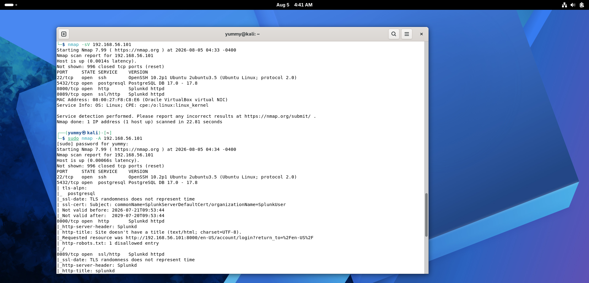
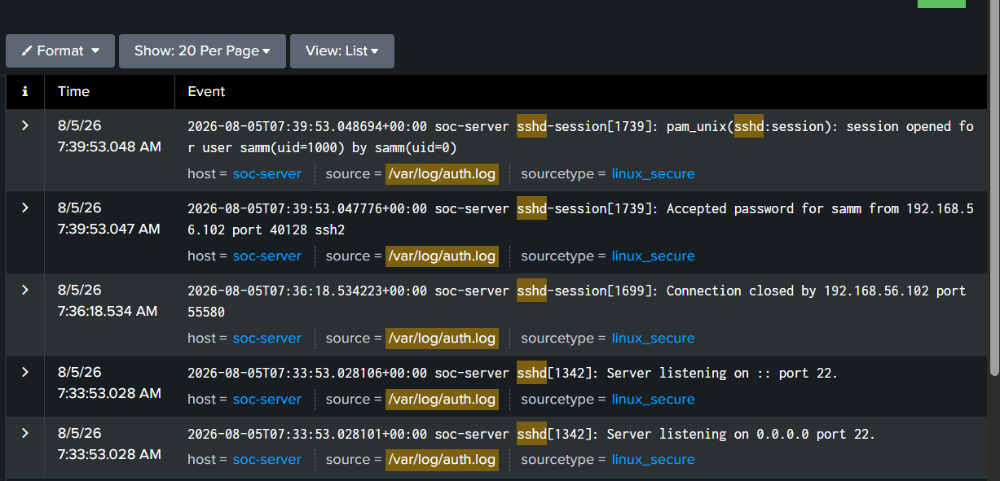
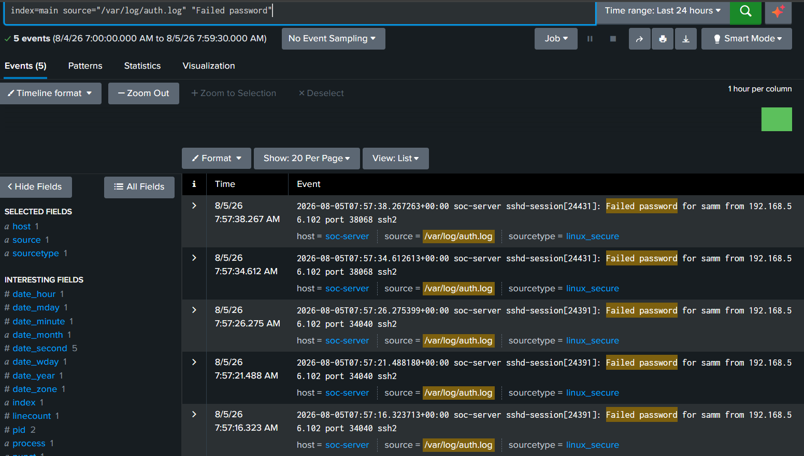
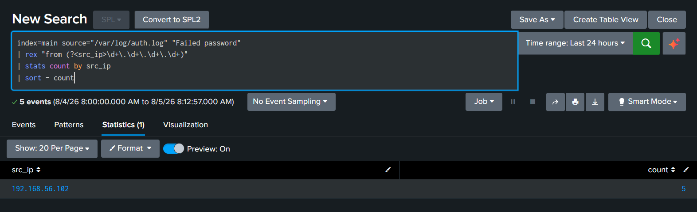
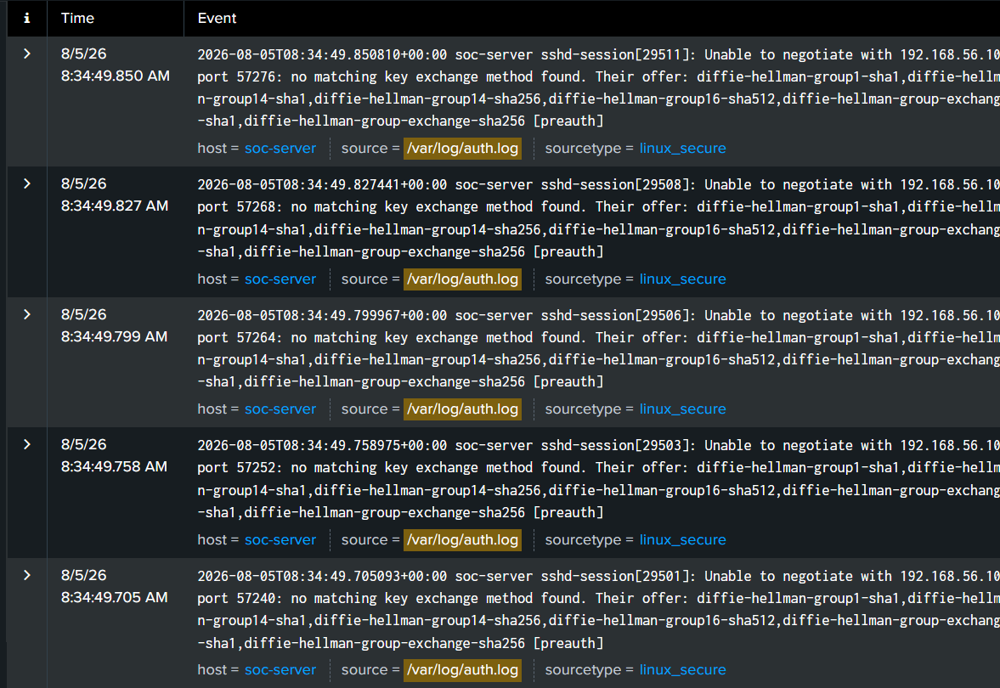
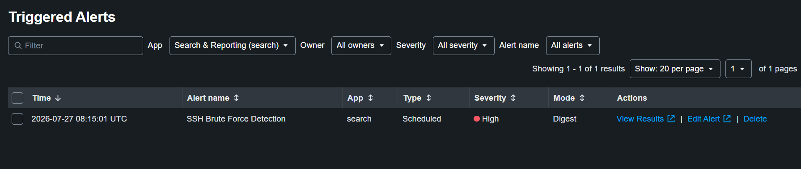
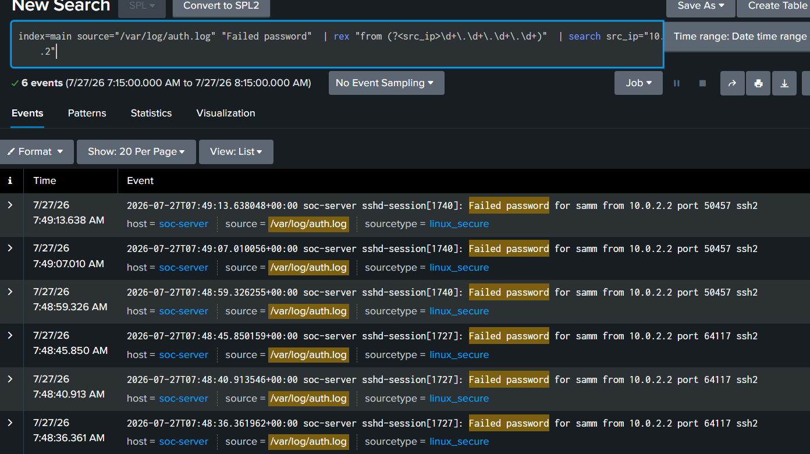
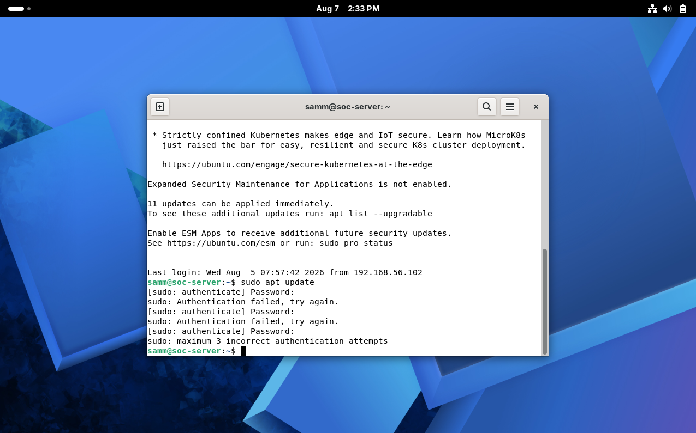
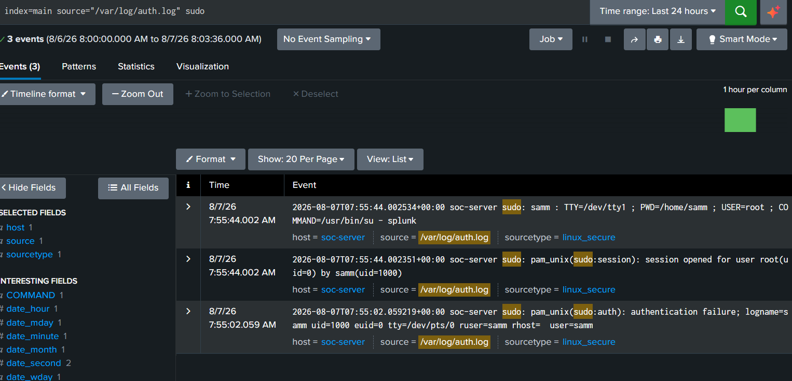

# Phase 5 - Attack Simulation & Lab Expansion

## Phase Objective

Expand the SOC lab into a small multi-host environment and generate real security events, including normal SSH logins, network scans, and brute-force attacks. The goal is to verify that Splunk correctly collects and detects real attack activity.

## Section 1 - Lab Expansion

The lab now consists of three virtual machines:

| VM              | Role                      | Purpose                                              |
| --------------- | ------------------------- | ---------------------------------------------------- |
| `soc-server`    | Ubuntu Server with Splunk | Monitored target and log collection server           |
| `kali-attacker` | Kali Linux                | Simulates reconnaissance and SSH brute-force attacks |
| `win-client`    | Windows Client            | Reserved for future Windows log collection           |

All VMs communicate through the internal lab network, allowing `kali-attacker` to directly access `soc-server` for realistic attack simulation.


**IP addressing confirmed during this phase's testing:**

| Host | IP Address | Confirmed By |
|---|---|---|
| `soc-server` | `192.168.56.101` | Target of the Nmap scan in Section 5 |
| `kali-attacker` | `192.168.56.102` | Source IP recorded on every SSH event in Splunk during this phase |

This is the first phase where `kali-attacker` is used for its actual purpose to generate traffic against `soc-server` and rather than just being provisioned and network-configured.

---

## Section 2 - Network Verification

Before treating any SSH or Nmap activity as meaningful, basic reachability and service availability from `kali-attacker` to `soc-server` were confirmed directly through the Nmap scan itself, since a live port/service scan is a strong combined test of both connectivity and service state.

```bash
nmap -sV 192.168.56.101
```

**Why this command was used:** `nmap -sV` performs a TCP port scan against the target and additionally attempts to fingerprint the exact service and version listening on each open port. Running this from `kali-attacker` toward `soc-server` verifies, in a single step, that the two hosts can communicate on the network **and** confirms which services are actually reachable and what they identify themselves as.

**Result - ports found open on `soc-server` (192.168.56.101):**

| Port | State | Service | Version |
|---|---|---|---|
| 22/tcp | open | ssh | OpenSSH 10.2p1 Ubuntu 2ubuntu3.5 |
| 5432/tcp | open | postgresql | PostgreSQL DB 17.0 – 17.8 |
| 8000/tcp | open | http | Splunkd httpd |
| 8089/tcp | open | ssl/http | Splunkd httpd |

This single result confirms several things at once: the host is reachable on the network, SSH is available (needed for Sections 3–4), and the Splunk web (`8000`) and management (`8089`) ports are visible from `kali-attacker` which meaning `soc-server`'s Splunk instance is exposed on this network segment, not just on `localhost`.



*Screenshot: terminal on `kali-attacker` running `nmap -sV 192.168.56.101` followed by `sudo nmap -A 192.168.56.101`, confirming network reachability and enumerating the open SSH, PostgreSQL, and Splunk services on `soc-server`.*

---

## Section 3 - SSH Baseline Test

Before simulating any attack, a normal, successful SSH login from `kali-attacker` to `soc-server` was performed and confirmed in Splunk.

**Why test a normal login first**: Before simulating attacks, a successful SSH login is performed to confirm that Splunk is correctly collecting normal authentication events. This establishes a baseline for comparing later brute-force activity.

**Observed events in `auth.log` / Splunk:**

```
sshd-session[1739]: Accepted password for samm from 192.168.56.102 port 40128 ssh2
sshd-session[1739]: pam_unix(sshd:session): session opened for user samm(uid=1000) by samm(uid=0)
sshd-session[1699]: Connection closed by 192.168.56.102 port 55580
sshd[1342]: Server listening on :: port 22.
sshd[1342]: Server listening on 0.0.0.0 port 22.
```



*Screenshot: Splunk search results showing the successful `Accepted password for samm from 192.168.56.102` login, the corresponding session-opened event, and the connection being closed cleanly that the baseline "normal" SSH activity pattern.*

This confirms two things: `kali-attacker` can successfully authenticate to `soc-server` over SSH, and that successful authentication is correctly captured in Splunk with the correct source IP and the same field the brute-force detection logic depends on.

---

## Section 4 - SSH Brute Force Simulation

With a working baseline confirmed, repeated failed SSH login attempts were generated from `kali-attacker` against `soc-server` to simulate brute-force activity.

**Search used to review the failed attempts:**

```spl
index=main source="/var/log/auth.log" "Failed password"
```

**Result:** 5 failed password events over the test window, all against user `samm`, all from `192.168.56.102` (`kali-attacker`):

```
sshd-session[24431]: Failed password for samm from 192.168.56.102 port 38068 ssh2
sshd-session[24391]: Failed password for samm from 192.168.56.102 port 34040 ssh2
```



*Screenshot: Splunk search results showing 5 `Failed password` events generated from `192.168.56.102` during the simulated brute-force window.*

**Aggregated detection query (the improved version of the Phase 4 detection logic, generalized to any source IP rather than a single hardcoded address):**

```spl
index=main source="/var/log/auth.log" "Failed password"
| rex "from (?<src_ip>\d+\.\d+\.\d+\.\d+)"
| stats count by src_ip
| sort - count
```

**Result:**

| src_ip | count |
|---|---|
| 192.168.56.102 | 5 |



*Screenshot: the `stats count by src_ip` query correctly aggregating all 5 failed attempts under `192.168.56.102`, proving the field-extraction and aggregation logic identifies the attacking host on its own, without needing to know the IP in advance.*

**What this proves**: The detection rule correctly identifies `kali-attacker` as the source of repeated failed SSH logins, confirming that the Splunk search works with real brute-force attack traffic.

**But checking the Triggered Alerts page for this activity did not show a new alert instance.** This is investigated in full under Section 7, Problem 1, since it points to a real gap between "the detection query works" and "the saved scheduled alert actually fires for new attackers."

---

## Section 5 - Nmap Reconnaissance

The `nmap -sV` and `nmap -A` scans described in Section 2 were run from `kali-attacker` against `soc-server`'s SSH service as part of the same reconnaissance activity, and in doing so, generated authentication-log entries of their own even though no login was ever attempted.

**Observed log entries in `auth.log` / Splunk, correlating with the scan window:**

```
sshd-session[29511]: Unable to negotiate with 192.168.56.102 port 57276: no matching key exchange method found.
Their offer: diffie-hellman-group1-sha1,diffie-hellman-group14-sha1,diffie-hellman-group14-sha256,
diffie-hellman-group16-sha512,diffie-hellman-group-exchange-sha1,diffie-hellman-group-exchange-sha256 [preauth]
```



*Screenshot: repeated `Unable to negotiate ... [preauth]` events in Splunk, each tied to a separate `sshd-session` ID, generated during the Nmap service-detection scan against `soc-server`'s SSH port.*

**Why this happened:** Nmap's service detection attempted to connect to the SSH service using unsupported key-exchange algorithms. Since the server does not allow these older algorithms, the connection was rejected during the SSH negotiation process.

**Why this is not a login attempt:** The `[preauth]` tag shows that the connection ended before SSH authentication began. No username or password was submitted, so this was a protocol negotiation failure rather than a login attempt.

Why this is useful: Multiple [preauth] failures from the same IP within a short time indicate SSH scanning activity. Although Splunk did not automatically detect or alert on these events, the logs were captured and can be manually investigated by an analyst.

> Note: This is not an automated detection. Splunk did not generate an alert for these events; they were found by manually searching auth.log. The purpose is to show that the raw logs are available for investigation.

---

## Section 6 - Verification

| Verified              | Result                                                                              |
| --------------------- | ----------------------------------------------------------------------------------- |
| SSH connectivity      | Confirmed with a successful SSH login and Nmap scan.                                |
| Splunk log ingestion  | Confirmed that new `auth.log` events appeared in Splunk with the correct source IP. |
| Alert triggering      | No new alerts were generated during this phase.                                     |
| Authentication events | Confirmed successful logins, failed logins, and `sudo` events were collected.       |
| Nmap SSH events       | Confirmed `[preauth]` events matched the Nmap scan timestamps.                      |

---

## Section 7 - Problems Encountered

### Problem 1: Brute-force simulation did not produce a new Triggered Alert

**Symptoms:** After generating 5 failed SSH login attempts from `kali-attacker` (`192.168.56.102`) and confirming via the `stats count by src_ip` query that the detection logic correctly identified the activity, the **Triggered Alerts** page still showed only the original alert instance from `2026-07-27 08:15:01 UTC` and no new entry for this phase's activity appeared.

**Root Cause:** The saved, scheduled alert (`SSH Brute Force Detection`, configured in Phase 4) uses the original test query, which filters explicitly to a hardcoded source IP:

```spl
index=main source="/var/log/auth.log" "Failed password"
| rex "from (?<src_ip>\d+\.\d+\.\d+\.\d+)"
| search src_ip="10.0.2.2"
```

This query only ever matches failed attempts from `10.0.2.2` — the IP used during Phase 4 testing. Since `kali-attacker`'s address (`192.168.56.102`) does not match that hardcoded filter, the saved alert has no way to fire for this phase's brute-force activity, regardless of how many failed attempts occurred.



*Screenshot: the Triggered Alerts page showing only the single `2026-07-27 08:15:01 UTC` entry and no new trigger corresponding to the Aug 5 activity from `kali-attacker`.*



*Screenshot: the original saved search behind the alert, confirming the hardcoded `search src_ip="10.0.2.2"` filter that explains why it did not fire for the new attacker IP.*

**Solution:** No changes were made to the saved alert in this phase. The manual `stats count by src_ip` query (Section 4) already shows the correct solution, but the saved alert still uses a hardcoded IP address. Updating the alert is planned as a future improvement because changing it now would affect the Phase 4 documentation.

**Verification:** This was confirmed by comparing the saved alert's search query with the source IP found in the `Failed password` events during this phase.

**Lesson Learned:** A detection rule that works during testing may fail to detect real attacks if it contains hardcoded values, such as a specific IP address. Test values should be replaced with more general search logic before using the alert in a real environment.

---

### Problem 2: Accidental sudo authentication failure during unrelated administrative work

**Symptoms:** While running routine administrative commands on `soc-server`, `sudo apt update` failed twice in a row with `sudo: Authentication failed, try again.`, followed by `sudo: maximum 3 incorrect authentication attempts`, temporarily locking out further `sudo` attempts in that terminal session.

**Root Cause:** The password was mistyped twice in a row when prompted by `sudo`, exhausting the default retry limit of three attempts.



*Screenshot: terminal on `soc-server` showing `sudo apt update` failing twice with `Authentication failed, try again.`, followed by the `maximum 3 incorrect authentication attempts` lockout message.*

**Solution:** Reran the command in a fresh attempt and entered the correct password, which succeeded without further issue.

**Verification:** Confirmed the event was captured correctly in Splunk, which recorded both the failed authentication attempt and the subsequent activity:
```
sudo: pam_unix(sudo:auth): authentication failure; logname=samm uid=1000 euid=0 tty=/dev/pts/0 ruser=samm rhost= user=samm
sudo: pam_unix(sudo:session): session opened for root by samm
sudo: samm : TTY=/dev/tty1 ; PWD=/home/samm ; USER=root ; COMMAND=/usr/bin/su - splunk
```



*Screenshot: Splunk search `index=main source="/var/log/auth.log" sudo` showing the authentication-failure event alongside subsequent successful `sudo` activity, confirming both the mistake and the recovery were logged accurately.*

**Lesson Learned:** This wasn't an attack, but it's a useful reminder that the same logging pipeline built to catch malicious activity also faithfully captures ordinary operator mistakes and which is exactly the intended behavior. It's also a small real-world reminder of why account lockout thresholds exist: even a legitimate, authorized user can trip one accidentally.

---

## Section 8 – Windows Log Collection (Work in Progress)

Universal Forwarder installation on `win-client` has been started, but Windows log integration into Splunk is still under investigation. This section will be fully documented — including configuration steps, verification, and any issues encountered and once that work is complete.

## References

- [Nmap Reference Guide](https://nmap.org/book/man.html)
- [OpenSSH `sshd_config` — key exchange algorithm documentation](https://man.openbsd.org/sshd_config)
- [Splunk `stats` Command Documentation](https://docs.splunk.com/Documentation/Splunk/latest/SearchReference/Stats)

## Next Phase

Phase 6 - Incident Response *(planned)*: using the multi-host activity captured in this phase (reconnaissance, baseline login, and brute-force simulation) as the basis for a documented investigation and response workflow, and generalizing the SSH Brute Force Detection alert identified as a gap in Section 7.
