# Phase 6 - Incident Response

## Phase 6 Objective

This phase investigates the security events generated during the attack simulations in Phase 5. The goal is to analyze the Linux authentication logs in Splunk, identify the accounts and source IP addresses involved, and organize the findings as part of a security investigation.

## Investigation

### SSH Brute Force Investigation

Two separate IP addresses generated failed SSH login attempts against soc-server during testing: `10.0.2.2`, the original NAT test source used since earlier phases, and `192.168.56.102`, the kali-attacker VM introduced in Phase 5.

**Comparing failed and successful attempts by source IP**

```spl
index=main source="/var/log/auth.log" ("Failed password" OR "Accepted password")
| rex "from (?<src_ip>\d+\.\d+\.\d+\.\d+)"
| stats count(eval(searchmatch("Failed password"))) as Failed_Attempts count(eval(searchmatch("Accepted password"))) as Successful_Logins by src_ip
```

| src_ip | Failed_Attempts | Successful_Logins |
|---|---|---|
| 10.0.2.2 | 25 | 19 |
| 192.168.56.102 | 8 | 3 |


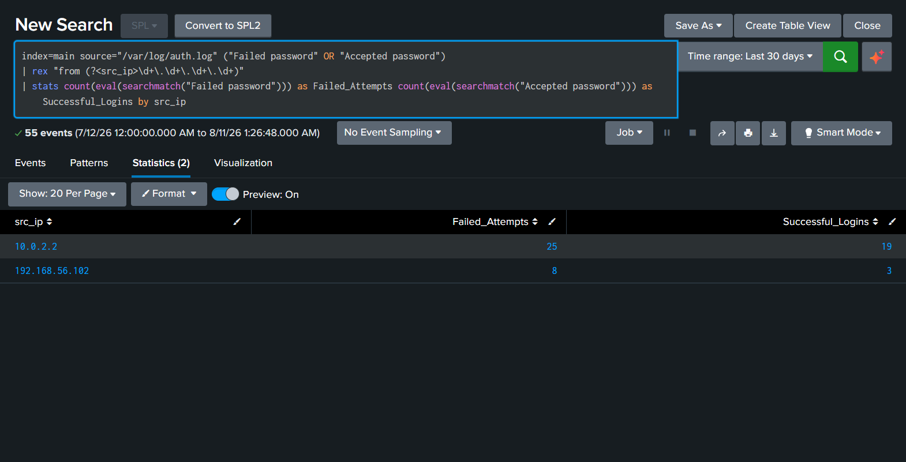

This confirms that both source IPs had failed and successful login attempts. The IP `10.0.2.2` shows more activity because it was used in earlier testing, while `192.168.56.102` shows fewer events from the recent attack simulation using `kali-attacker`.

**Failed attempts grouped by source IP**

```spl
index=main source="/var/log/auth.log" "Failed password"
| rex "from (?<src_ip>\d+\.\d+\.\d+\.\d+)"
| stats count by src_ip
| sort -count
```

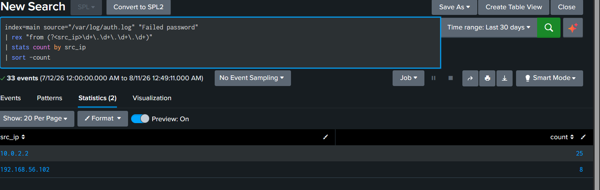

**Reviewing failed attempts from 10.0.2.2**

```spl
index=main source="/var/log/auth.log" "Failed password" | rex "from (?<src_ip>\d+\.\d+\.\d+\.\d+)" | search src_ip="10.0.2.2"
```

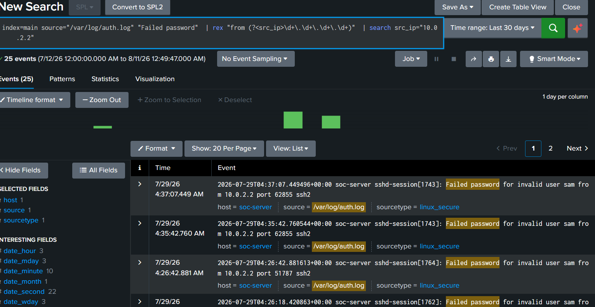

A number of these attempts were against `invalid user sam`, a username that does not exist on soc-server. This is a different account than `samm`, the real account on the server:

```
2026-07-29T04:37:07.449496+00:00 soc-server sshd-session[1743]: Failed password for invalid user sam from 10.0.2.2 port 62855 ssh2
```

**Reviewing failed attempts from 192.168.56.102**

```spl
index=main source="/var/log/auth.log" "Failed password" | rex "from (?<src_ip>\d+\.\d+\.\d+\.\d+)" | search src_ip="192.168.56.102"
```

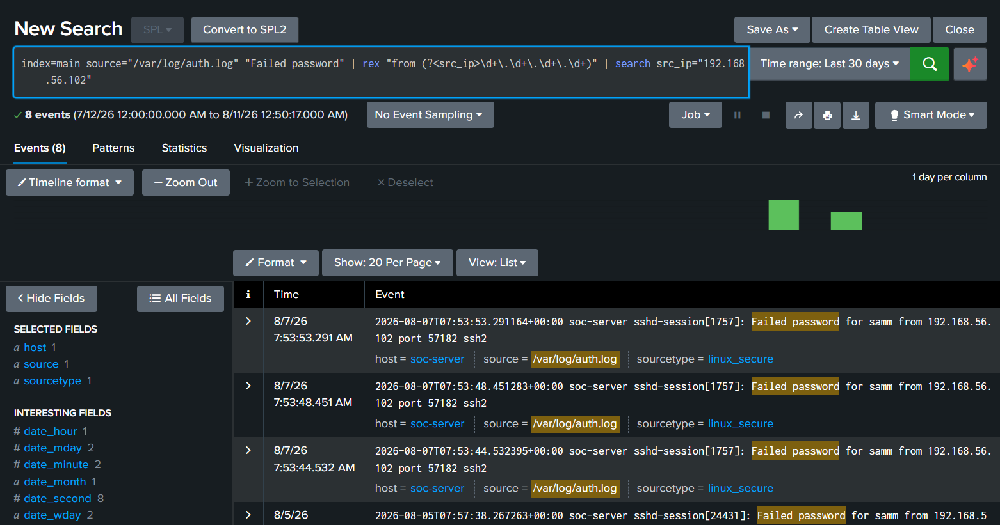

This search returned 8 events, all against the valid account `samm`, unlike the invalid user attempts seen from 10.0.2.2.

**Full session detail for 192.168.56.102**

```spl
index=main source="/var/log/auth.log" "192.168.56.102"
| stats count by _raw
```

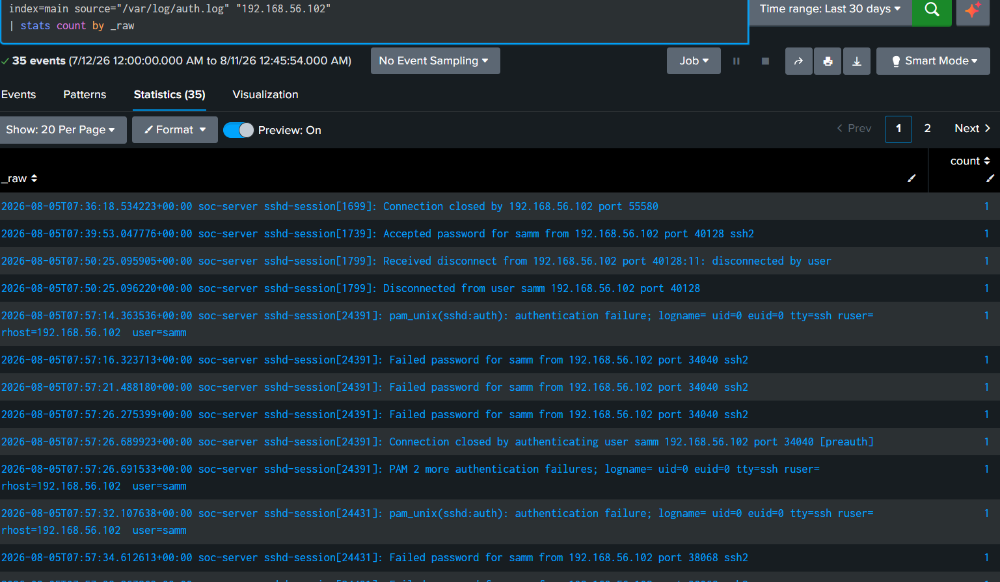

Looking at the raw events instead of just the failed password lines shows the full shape of the activity. On 8/5/26, there were two separate brute force attempts, session 24391 and session 24431, each ending the same way, with the SSH client itself closing the connection after the third failed attempt:

```
2026-08-05T07:57:26.689923+00:00 soc-server sshd-session[24391]: Connection closed by authenticating user samm 192.168.56.102 port 34040 [preauth]
2026-08-05T07:57:26.691533+00:00 soc-server sshd-session[24391]: PAM 2 more authentication failures; logname= uid=0 euid=0 tty=ssh ruser= rhost=192.168.56.102 user=samm
```

The `[preauth]` tag and the `PAM 2 more authentication failures` line both confirm the session ended because of repeated failed logins, and the pattern of exactly 3 failures per session matches the default retry limit most SSH clients use before giving up.

**A second brute force attempt on 8/7/26**

```spl
index=main source="/var/log/auth.log" "Failed password"
```

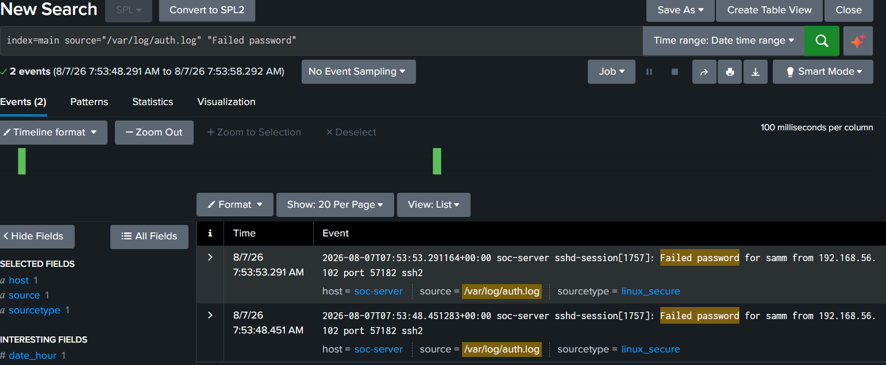


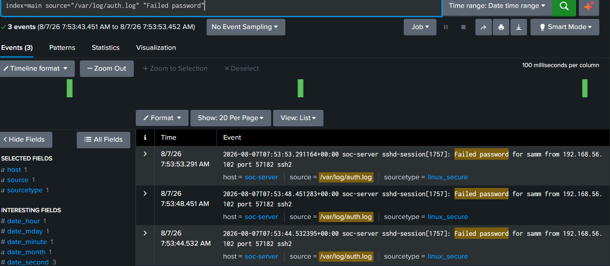


A second round of 3 failed attempts occurred on 8/7/26 between 7:53:44 AM and 7:53:53 AM, session 1757, again from 192.168.56.102 against the account `samm`. Shortly after, a successful login followed:

```
2026-08-07T07:54:18.265579+00:00 soc-server sshd-session[1762]: Accepted password for samm from 192.168.56.102 port 37322 ssh2
```

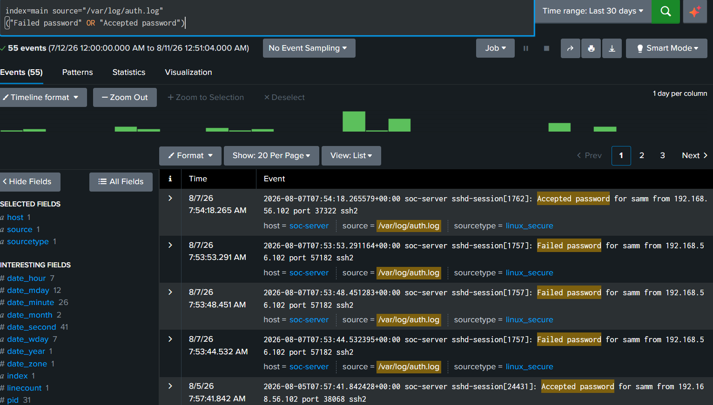

**Investigation summary:** kali-attacker generated two separate SSH brute force attempts against the valid account `samm`, one on 8/5 and one on 8/7. Both attempts stopped at 3 failed logins per session, matching normal SSH client behavior rather than an automated tool retrying indefinitely. The account was never actually broken into through guessing. The 8/7 attempt was followed by a successful login on a new session once the correct password was used, which is consistent with testing rather than an actual compromise.

---

### Nmap Reconnaissance Investigation

```spl
index=main source="/var/log/auth.log" "Unable to negotiate"
```

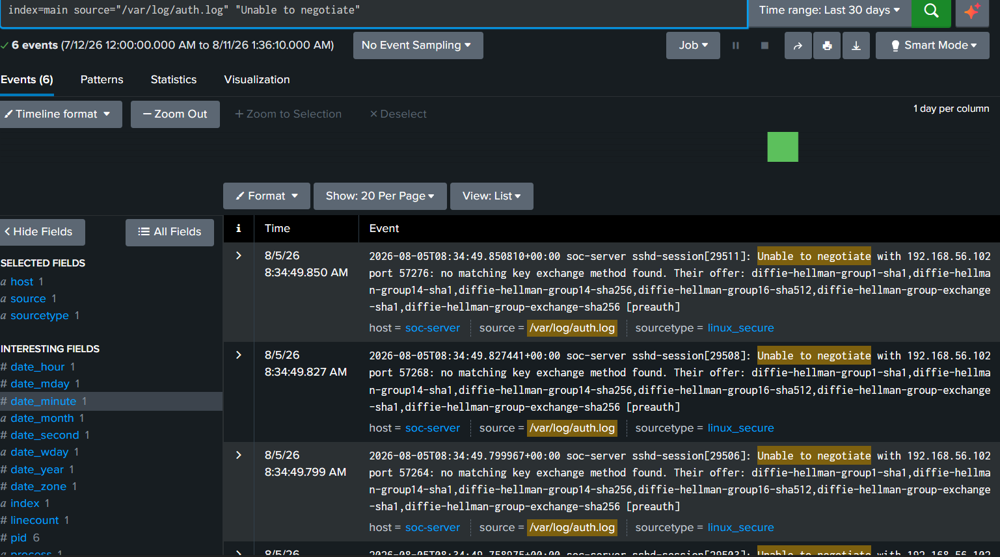

This search returned 6 events, all from `192.168.56.102`, all within the same second on 8/5/26 around 8:34:49 AM:

```
2026-08-05T08:34:49.850810+00:00 soc-server sshd-session[29511]: Unable to negotiate with 192.168.56.102 port 57276: no matching key exchange method found. Their offer: diffie-hellman-group1-sha1,diffie-hellman-group14-sha1,diffie-hellman-group14-sha256,diffie-hellman-group16-sha512,diffie-hellman-group-exchange-sha1,diffie-hellman-group-exchange-sha256 [preauth]
```

These events were generated by Nmap during its service detection scan. Nmap connected to the SSH port using key exchange algorithms that were not supported by `soc-server`, so the connection failed before authentication. The `[preauth]` tag confirms that no username or password was sent, meaning this was not a login attempt.

**Investigation Summary:** Six `[preauth]` events from the same source IP occurred within one second, indicating an automated SSH scan rather than a manual connection. This confirms that `kali-attacker` scanned `soc-server` during the reconnaissance activity in Phase 5. Although no unauthorized login occurred, these logs provide useful evidence that the scan took place.


### Privilege Escalation Investigation

```spl
index=main source="/var/log/auth.log" sudo
```

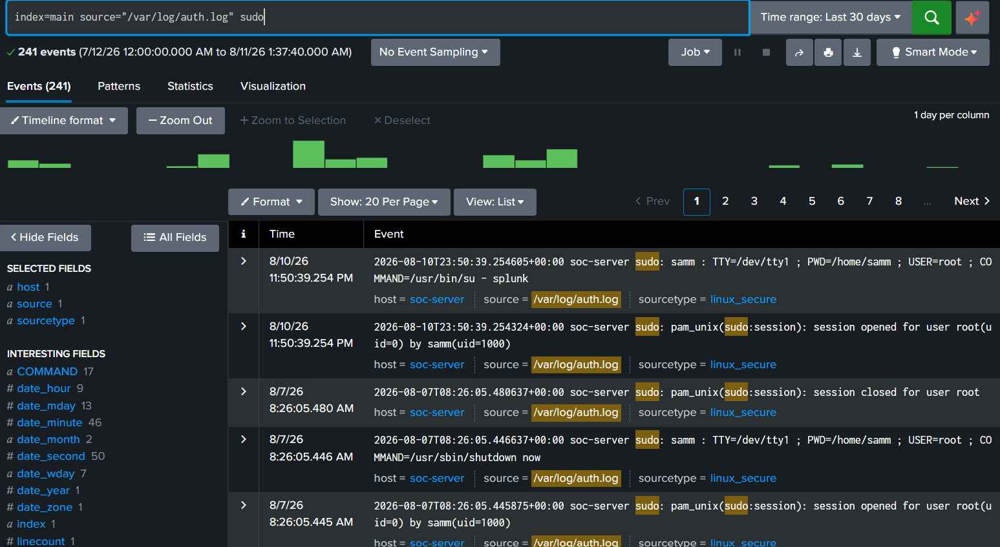

This search returned 241 events over 30 days. The events reviewed show routine administrative activity carried out by `samm`, including switching to the splunk service account and shutting the server down:

```
2026-08-10T23:50:39.254324+00:00 soc-server sudo: samm : TTY=/dev/tty1 ; PWD=/home/samm ; USER=root ; COMMAND=/usr/bin/su - splunk
2026-08-07T08:26:05.446637+00:00 soc-server sudo: samm : TTY=/dev/tty1 ; PWD=/home/samm ; USER=root ; COMMAND=/usr/sbin/shutdown now
```

**Investigation summary:** the sudo activity reviewed here is normal administrative use by `samm`, not a sign of privilege escalation or misuse. No brute force pattern against sudo was found in these events.

## Timeline

Every timestamp below is taken directly from the Splunk searches above.

| Time | Event |
|---|---|
| 8/5/26 7:39:53 AM | Accepted password for samm from 192.168.56.102 |
| 8/5/26 7:50:25 AM | Session disconnected by user samm, 192.168.56.102 |
| 8/5/26 7:57:14 – 7:57:26 AM | 3 failed password attempts from 192.168.56.102 (session 24391), connection closed by client after the third failure |
| 8/5/26 7:57:32 – 7:57:34 AM | Additional failed password attempts from 192.168.56.102 (session 24431) |
| 8/5/26 8:34:49 AM | 6 SSH negotiation failures from 192.168.56.102, generated by the nmap scan |
| 8/7/26 7:53:44 – 7:53:53 AM | 3 failed password attempts from 192.168.56.102 (session 1757) |
| 8/7/26 7:54:18 AM | Accepted password for samm from 192.168.56.102 (session 1762) |

A broader search across the full `auth.log` source, sorted by time, returned 907 events between 7/12/26 and 8/11/26, confirming the log source retains enough history to cover every event referenced above.

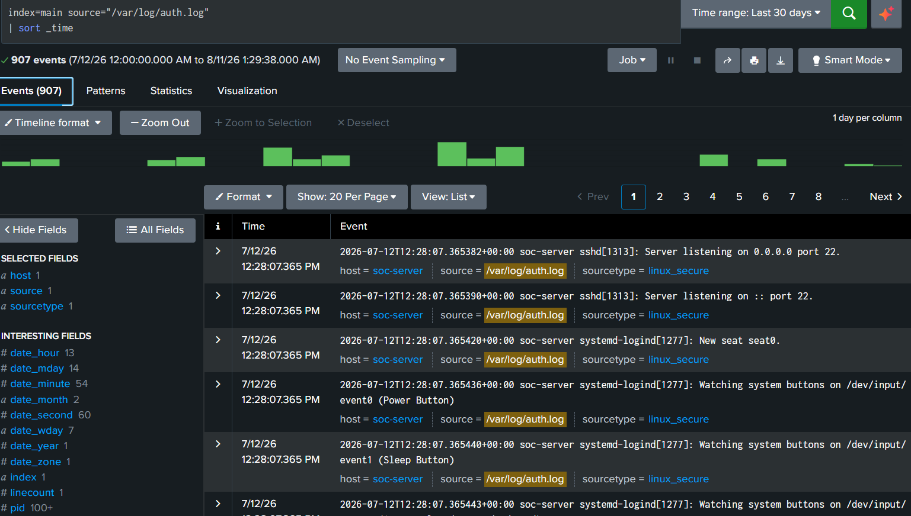

## Evidence

| Screenshot | What It Shows |
|---|---|
| `01-failed-password-narrow-window.png` | Failed password events from session 1757 in a narrow time window |
| `02-failed-accepted-stats-by-ip.png` | Failed and accepted login counts grouped by source IP |
| `03-failed-accepted-events-30days.png` | Failed and accepted events over 30 days, including the successful login that followed the 8/7 brute force attempt |
| `04-failed-password-count-by-ip.png` | Failed password count grouped by source IP |
| `05-failed-password-src-10-0-2-2.png` | Failed password events specific to 10.0.2.2, including attempts against an invalid user |
| `06-failed-password-src-192-168-56-102.png` | Failed password events specific to 192.168.56.102 |
| `07-raw-session-events-192-168-56-102.png` | Full raw event list for 192.168.56.102, showing session boundaries and disconnects |
| `08-failed-password-3events-aug7.png` | The 3 failed password events from the 8/7 brute force attempt |
| `09-nmap-unable-to-negotiate-events.png` | SSH negotiation failures generated by the nmap scan |
| `10-sudo-events-30days.png` | Sudo activity over 30 days |
| `11-full-authlog-907events.png` | Full auth.log source sorted by time |

## MITRE ATT&CK Mapping

| Activity | Technique | ID |
|---|---|---|
| SSH Brute Force | Brute Force | T1110 |
| SSH Login | Remote Services: SSH | T1021.004 |
| Successful Authentication | Valid Accounts | T1078 |
| Network Reconnaissance | Active Scanning | T1595 |

## Lessons Learned

Searching for `"Failed password"` and then grouping the results by source IP using `stats` made it easy to separate activity from different hosts. Running the same search again on 8/7 confirmed that the brute-force pattern was consistent and repeatable.

Reviewing all events for a specific source IP, instead of only the failed login events, revealed additional details such as SSH disconnect events and the point where the client stopped after three failed attempts. This provided a clearer picture of the activity.

Reviewing the `sudo` events also showed the importance of adding context to search results. Although many events were returned, checking a sample against expected administrator activity confirmed that the events were normal.


## Conclusion

This investigation confirmed that Splunk successfully collected and correlated the Linux authentication events generated during the attack simulation. The SSH brute force attempts, the successful logins that followed, and the SSH negotiation failures caused by the nmap scan were all present in `auth.log` with accurate timestamps and source IP addresses, and the same searches produced consistent results when run again days later. The logging pipeline built in earlier phases held up under real, generated attack traffic and provided enough detail to reconstruct exactly what happened and when.
